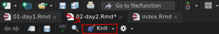

# Bring on the Data! {#day2}

```{r, include=FALSE}
knitr::opts_chunk$set(eval = TRUE)
```

## Project-based Workflow

Whenever you work on a new project (like a lab analyis),
create a new RStudio Project. You can find the quick menu
for this in the top right corner of RStudio.

Projects automatically set your so-called `working directory`
to this project folder. This is where R will search for
files and save files to. Every file path should be relative
to this working directory. This also enables the RStudio autocompletion
to help you find your files. Inserting a pair of quotations marks (`"`)
into your code and pressing Tab or Ctrl+Space shows you the files
and folders in your working directory:

```{r, eval=FALSE}
""
```

### Workflow of a Data Analysis

A typical workflow according to Hadley Wickam, Chief Scientist at
RStudio:

```{r workflow-img, fig.align='center', fig.cap="Quelle: @wickhamDataScienceImport2017", echo=FALSE}
knitr::include_graphics("img/workflow.png")
```

### Communication!

Your thoughts during data analysis matter (To future-you and others)! 

This is one of the main reasons I use Rmarkdown
instead of R scripts for teaching as well
as regular data analysis. This `.rmd` format mixes
text with code "chunks". You can create one in the top left corner
as well. Choose "R markdown" and press OK.

```{r, echo=FALSE}
knitr::include_graphics("img/newrmd.png")
```

This will present you with an example document showcasing
some of the possibilites. A plethora of information can be found
in the official
[Rmarkdown guide](https://bookdown.org/yihui/rmarkdown/) [@R-rmarkdown].

Text is interpreted as markdown, with special characters to mark
text as bold, italics, a heading etc. and text in so called
code chunks is interpreted as (R) code. You can insert R code chunks
with the shortcut Ctrl+Alt+I or the button in the upper right corner
of the code editor window.

Hitting the "knit" button will run the whole document and produce
a report in the specified format (html, docx, pdf and many others).

```{r, echo=FALSE}

```

### Important RStudio-Settings

For the sake of reproducibility, please set these settings
(Tools -> Global Options) in your RStudio.

```{r, echo=FALSE, fig.show='hold', out.width='50%', fig.cap="RStudio Einstellungen"}
knitr::include_graphics(c("img/RS_settings.png", "img/RS_settings2.png"))
```

## Packages: The Tidyverse

This is where a lot of the power of R comes from.

Packages are...

Installing packages

```{r, eval = FALSE}
# install tidyverse
install.packages("tidyverse")
```

Load packages:

```{r}
# load tidyverse
library(tidyverse)
```

The tidyverse is

## Exercise from day 1

### Questions

- What do we get when we execute `c("12", 13, 14)[2] + 1`?
  - Try do predict what will happen before executing the code.
  - Why does it happen that way?
- Make a vector x with the numbers from 1 to 10
- Make a vector y with the same content as x
- Plot both vectors as points (y ~ x)
  - hint: use the `plot` function
- Do a linear regression and add it as a line to the plot
- How can we find out more about the linear regression object?

### Answers

```{r, eval = FALSE}
c("12", 13, 14)[2] + 1
vec <- c("12", 13, 14)
vec[2]
vec[2] + 1
```

Ctrl+Shift+Enter to run the whole chunk

```{r}
x <- 1:10
y <- x
# plot(x, y)
plot(y ~ x)
linearModel <- lm(y ~ x)
abline(linearModel)
```

## Reading data

`readr`-package from the `tidyverse`.

`read_` 
`write_`

```{r}
# tidyverse already loaded
```

Take your favourit table calculation program (Excel, Libre Office).
We create a list of course participants and at the same
time note the row in which they are sitting and their hair length.

We can save the file as `.csv` (Comma Separated Values),
which is a plain text file and can be opened
with any text editor. As a destination we
create a folder in our project called `data`,
to keep everything organized.

Ctrl+Space for cool autocomplete (or tab)

```{r}
read_csv("data/students.csv")
```

You might have a german Excel version... 

Enter: The semicolon ";"

```{r}
read_csv2("data/students.csv")
```

```{r}
# read_csv
read_delim("data/students.csv", delim = ",")
# read_csv2
read_delim("data/students.csv", delim = ";")
```

`Read_csv` also works with data from the internet!

E.g. my github repository

```{r}
# show data on github
```

You can also read straight from excel files.

```{r}
readxl::read_excel("data/students.xlsx")
```

```{r}
students <- read_csv("data/students.csv")
```

View your data in a new tab in RStudio

```{r, eval = FALSE}
View(students)
```

Writing data works analogous to that.

```{r, eval=FALSE}
# write data with write_
write_csv(students, path = "data/students2.csv")
```

Now what do we do with the data?

Enter: `dplyr`

## The pipe and dplyr verbs

The `dplyr` package and the pipe (`%>%`)

Data needs to be processed.

Functions that process data are used sequentially.

The common way (in other languages) to write this
looks about like this:


```{r}
# define add_one
addOne <- function(x) x + 1

# define standardize to max
standardize <- function(x) x / max(x)

callOutResult <- function(x) paste("Your result is", x)
# sequentially change x
```


```{r}
data <- 1:5
newData <- addOne(data)
evenNewerData <- standardize(newData)
callOutResult(evenNewerData)
```

This is not fun to write! We might want to
overwrite our original data instead of 
creating a new varible for every step

```{r}
data <- 1:5
data <- addOne(data)
data <- standardize(data)
callOutResult(data)
```

This is a lot of repetition!

Maybe turn to math notation?

```{r}
data <- 1:5
callOutResult(standardize(addOne(data)))
```

Who wants to type `x` that often?

Enter: The pipe `%>%`

- Insert a pipe with Ctrl+Shift+M
  (Or manually type it out)

With a function g and a function f
f(g(x)) = x %>% g() %>% f()

```{r}
data <- 1:5
data %>% addOne() %>% standardize() %>% callOutResult()
```

We can also write each step on a new line
(because R doesn't care about new lines)

```{r}
data %>% 
  addOne() %>% 
  standardize() %>% 
  callOutResult()
```

For functions with more than one argument,
the pipe inserts the stuff from the left side
as the first agrument!

```{r}
addNumber <- function(data, number) data + number
```

```{r}
data %>% addNumber(3)
```

Enter: The `dplyr` verbs

- `select`
- `filter`
- `arrange`
- `mutate`
- `summarise`
- Additionally:
  - `count`
  - `group_by` (adverb)

### select

Select columns of a data.frame.

```{r, eval=FALSE}
# with the students data
# remember the "base-R" way to select columns?
# Now we only need to remember one word:
select(students, name, row)

# or
students %>% select(name, row)
# this is equivalent to:
students[, c("name", "row")]
```

### filter

Filter a data.frame based on a condition in a column.

```{r, eval=FALSE}
# remember the old way to subset?
students[students$row == 1, ]
# the new syntax is more straightforward:
students %>% 
  filter(row == 1)
```

Combine those:

```{r}
students[students$row == 1, 1]

# equivalent but nicer to read in your head
students %>% 
  filter(row == 1) %>% 
  select(name)
```

> One thing to note: As of now, we have not changed the students data!
> because we only looked at the output of the functions in the console
> and did not assign anything (with <- )

### mutate

Change a column or add a new one.
Like the length of your names.

```{r}
# calculate string lengths
# last week in base R
students$nameLength <- str_length(students$name)

students %>% 
  mutate(nameLength = str_length(name))
```

We might need this modified/enhanced data later,
so let's  overwrite the variable `students`:

```{r}
students <- students %>%  
  mutate(nameLength = str_length(name))
```

```{r}
students
```


### arrange

Who has the longest name?

```{r}
students %>% 
  arrange(desc(nameLength))
```

```{r}
students %>% 
  filter(nameLength == max(nameLength))
```

### count

How many are in the first row?

How many based on hairlength?

```{r}
students %>% count(row)
```

```{r}
students %>% count(row, hairlength)
```


### summarise

What is the mean name-length?

```{r}
# summarise
# in base-R:
mean(students$nameLength)

# in the tidyverse
students %>% 
  summarise(nameLength = mean(nameLength))
```

### group_by und summarise

Do participants in the first row have longer names?

```{r}
# group by, summarise, ungroup
# ungroup is not always necessary but it can be surprising if
# you forget that your data had groups
students %>% 
  group_by(row) %>% 
  summarise(nameLengh = mean(nameLength))
```

```{r}
students %>% 
  group_by(row, hairlength) %>% 
  summarise(nameLength = mean(nameLength)) %>% 
  arrange(desc(nameLength))
```

Do people with long hair tend to sit in the first row?

```{r}
students %>% 
  filter(row != 0) %>% 
  count(row, hairlength)
```

#### Sidenote

```{r}
# pull pulls out a column as a vector from a dataframe
# the conditions in filter stack
students %>% 
  filter(row == 2, hairlength == "l") %>% 
  # select(name) %>%
  pull(name)
```

```{r}
# we can also combine conditions with or ( | )
students %>%
  filter(row == 2 | hairlength == "l")
```


### Moving on the probability

The question we might ask now is:

> If every person was randomly seated,
> What would be the probability to find
> that many (or more) with long hair in
> the first row?

## But what is Probability?

Two concepts of probability ($P$):

- Probability inside your head: strength of belief; may vary among people
- Probability „out there“: long-term frequency of an event;
can be empirically measured or predicted from a model [@motulsky2017].

### Example:

Categorical / discrete data: _Drawing (blindly) from a hat._

```{r}
students %>% 
  count(row, hairlength)
```

```{r}
students %>%
  filter(row != 0) %>% 
  count(hairlength)
```


```{r}
# create a "hat" of hairlengths
# with the numbers observed in our course
hat <- c( rep("l", 6), rep("s", 3) )
hat
```

```{r}
# sample / draw from said hat
# the same number of observed long haired in first row
sample(hat, 1)

# Look at the help for sample (default: replace = FALSE)
sample(hat)

firstRow <- sample(hat, 5)

# How many in this sample have long hair?
mean(firstRow == "l")
sum(firstRow == "l")

# Explanation of for-loop for simulation
# with just print
for (i in 1:10) {
  print(i)
}


```


```{r}
## Simulation
# set N
N <- 1000

# create vector for the sum from each draw
results <- 1:N

# assign the results in a loop
for (i in 1:N) {
  draw <- sample(hat, 5)
  results[i] <- sum(draw == "l")
}

# mean of results
mean(results)
```


```{r}
hist(results)
```


```{r}
# How surprised should we be? -> Calculate probability for random event
# sum greater than or equal to observed frequency / length
mean(results >= 4)
```

### P-Values {#p-values}

Introduced in the 1920th by Ronald Fisher:

> _"The P value is defined as the probability, under the assumption of
  no effect or no difference (the null hypothesis),
  of obtaining a result equal to or more extreme
  than what was actually observed."_
> $-$ (Original: [Statistical Methods for Research Workers](https://en.wikipedia.org/wiki/Statistical_Methods_for_Research_Workers)) [@fisher1990]

By convention: p ≤ 0.05 is "significant"

In other words, a p-Value is...

> _"... a measure of how surprised you should be
  if there is no actual difference […],
  but you got data suggesting there is"_
>  $-$ Alex Reinhart [@reinhart2015]

We calculate the exact p-value:

```{r}
students %>% 
  count(hairlength)
```


```{r}
# hypergeometric distribution
# note that it calculates cumulative probabilities!
# default: P(X <= x)
# default: P(X >= x)
1 - phyper(q = 3, m = 6, n = 3, k = 5)
```

Hypergeometric distribution for our example

```{r}
barplot(dhyper(x = 0:6, m = 6, n = 3, k =  5), names.arg = 0:6)
```

## Exercise: Transfer to new Data

Starwars, a datenset included with the tidyverse.

```{r}
?starwars
```

- In a new Rmarkdown document:
- Preview the dataset
- Select the columns name, heigth, mass, gender
- Who is the heaviest?
- Convert height from cm to m
- Which gender is taller on average in StarWars?
  - _Hint:_ use group_by and summarise
  - You might need the argument "na.rm = TRUE" in `mean()`


- Simulate drawing 81 characters (or rather genders) from a hat.
  Repeat this 1000 times.
- How often do you obtain 62 or more male characters?
- How surprised should we be about the data?
- Calculate an exact p-value for the observed frequency
  - note: use pbinom instead of phyper to sample WITH replacement
- Bonus: Create a plot! (any variables that seem interesting)
- Knit the document into a report

### Solutions


```{r}
knitr::opts_chunk$set(eval=FALSE, include=FALSE)
```


```{r}
# this way is more similar to the experiments
# with long and short hair, but a bit dissimilar to
# the star wars data because it ignores other genders
# but I do not know the proportion of non-binary genders
# in the whole starwars universe
hat <- c("male", "female")
sample(hat, 81, replace = TRUE)
```

0 as a result is expected, you did not make mistake.
It is just that unlikely!

```{r}
1 - pbinom(q = 61, size = 81, prob = 0.5)
```


```{r, eval = FALSE}
View(starwars)
```


```{r}
greatestMass <-  starwars %>% 
  filter(mass == max(mass, na.rm = TRUE))

greatestMass$name
```

```{r}
starwars %>% 
  filter(mass == max(mass, na.rm = TRUE)) %>% 
  pull(name)
```


Spoilers ahead


```{r, eval=FALSE}
starwars
```

```{r}
# the last step is optional but reduces
# clutter in this document output
starwars %>%
  select(name, height, mass, gender) %>% 
  arrange(desc(mass)) %>% 
  head(5)
```

```{r, fig.cap="Jabba the Hut, Quelle: Wikipedia", echo=FALSE}
knitr::include_graphics("img/jabba.png")
```

```{r}
starwars <- starwars %>% 
  mutate(height = height / 100)
```

```{r}
starwars %>% 
  filter(!is.na(gender)) %>%  # ! means "not"
  group_by(gender) %>% 
  summarise(height =  mean(height, na.rm = TRUE))
```


```{r}
starwars %>% count(gender)
```


```
Wie wahrscheinlich ist es, bei gleicher Verteilung von Geschlechtern im Universum,
allein durch Zufall diesen oder einen höheren Männerüberschuss im starwars
Datenset zu erhalten? Die allein zufällige Verteilung ist unsere Nullhypothese $H_0$.
```

```{r}
hat <- c("male", "female")

total_genders <- starwars %>%
  filter(!is.na(gender)) %>% nrow()

n_males <- starwars %>% 
  filter(gender == "male") %>% 
  nrow()

# This part is an alternative to for loops.
# Instead of the loop, we create a function
# And then apply (map) that function over all
# elements of our vector 1:N
draw_from_hat <- function(hat, n) {
  draw <- sample(hat, n, replace = TRUE)
  sum(draw == "male")
}

N <- 100000
results <- map_int(1:N, ~ draw_from_hat(hat, total_genders) )
hist(results)
sum(results >= n_males)
```


```
Der exakte P-Value wird hier mit `pbinom`
(also der Wahrscheinlichkeit für binomialverteilte Daten) statt
`phyper` (Wahrscheinlichkeit für hypergeometrisch verteilte Daten)
ausgerechnet, da wir das Verhältnis der Gender im Universum
für konstant annehmen, selbst wenn wir eines daraus für unser
Datenset gezogen haben. Wir samplen daher mit `replace = TRUE`
und verwenden die Binomialverteilung.
```


```{r}
pbinom(q = n_males - 1,
       size = total_genders,
       prob = 0.5,
       lower.tail = FALSE)
```

```
Das Ergebnis ist statistisch signifikant bei einem typischen Signifikanzlevel von
$p \leq 0.05$ ($5~\%$). Merke an dieser Stelle, dass wir nicht sagen
können, etwas bewiesen zu haben, wir können jedoch sagen, dass wir die
Nullhypothese ("es gibt keinen Effekt von Gender auf die
Auswahl ins Datenset") ablehnen.
```

```
> _Thus, we reject the null hypothesis._
Für mehr Informationen siehe:
```


```{r, eval=FALSE}
?phyper
?pbinom
```

```
Sowie die unglaublich guten Visualisierungen von [Seeing Theory](https://seeing-theory.brown.edu/index.html)!
```


### Bonus

```{r}
starwars %>%
  filter(!is.na(homeworld)) %>% 
  group_by(homeworld) %>%
  summarise(height = mean(height, na.rm = TRUE),
            mass   = mean(mass, na.rm = TRUE)) %>% 
  mutate(homeworld = fct_reorder(homeworld, height)) %>% 
  ggplot(aes(homeworld, height, fill = mass)) +
    geom_col() +
    coord_flip()
```

