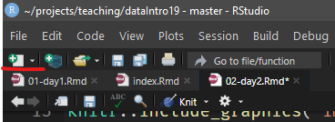

# Bring on the Data! {#day2}

```{r, include=FALSE}
knitr::opts_chunk$set(eval = TRUE)
```

## Project-based Workflow

Whenever you work on a new project (like a lab analyis),
create a new RStudio Project. You can find the quick menu
for this in the top right corner of RStudio.

Projects automatically set your so-called `working directory`
to this project folder. This is where R will search for
files and save files to. Every file path should be relative
to this working directory (The RStudio autocompletion helps you).

### Workflow of a Data Analysis

A typical workflow according to Hadley Wickam, Chief Scientist at
RStudio:

```{r workflow-img, fig.align='center', fig.cap="Quelle: @wickhamDataScienceImport2017", echo=FALSE}
knitr::include_graphics("img/workflow.png")
```

### Communication!

Your thoughts during analysis matter!
(To future-you and others)

This is one of the main reasons I use Rmarkdown for
teaching as well as regular data analysis

```{r, echo=FALSE}

```

[Rmarkdown guide](https://bookdown.org/yihui/rmarkdown/)
see @R-rmarkdown.

Ctrl+Alt+I

### Important RStudio-Settings

```{r, echo=FALSE, fig.show='hold', out.width='50%', fig.cap="RStudio Einstellungen"}
knitr::include_graphics(c("img/RS_settings.png", "img/RS_settings2.png"))
```

## Packages: The Tidyverse

This is where a lot of the power of R comes from.

Packages are...

Installing packages

```{r, eval = FALSE}
# install tidyverse
```

Load packages:

```{r, eval = FALSE}
# load tidyverse
```

The tidyverse is

## Exercise from day 1

### Questions

- What do we get when we execute `c("12", 13, 14)[2] + 1`?
  - Try do predict what will happen before executing the code.
  - Why does it happen that way?
- Make a vector with the numbers from 1 to 10
- Make a vector y with the same content as x
- Plot both vectors as points (y ~ x)
- Do a linear regression and add it as a line to the plot
- How can we find out more about the linear regression object?

### Answers

```{r}

```

## Reading data

`readr`-package from the `tidyverse`.

`read_` 
`write_`

```{r}
# tidyverse already loaded
```

Take your favourit table calculation program (Excel, Libre Office).
We create a list of course participants and at the same
time note the row in which they are sitting and their hair length.

We can save the file as `.csv` (Comma Separated Values),
which is a plain text file and can be opened
with any text editor. As a destination we
create a folder in our project called `data`,
to keep everything organized.

```{r}
# Read data with read_csv
```

You might have a german Excel version... 

Enter: The semicolon ";"

```{r}
# show read_csv2 and what happens if things go wrong
```

`Read_csv` also works with data from the internet!

E.g. my github repository

```{r}
# show data on github
```

You can also read straight from excel files.

```{r}
# explain  :: notation
# readxl data
```

Writing data works analogous to that.

```{r}
# write data with write_
```

Now what do we do with the data?

Enter: `dplyr`

## The pipe and dplyr verbs

The `dplyr` package and the pipe (`%>%`)

Data needs to be processed.

Functions that process data are used sequentially.

The common way (in other languages) to write this
looks about like this:


```{r}
# define add_one
# define standardize to max

# sequentially change x

```

This is a lot of repetition!

Who wants to type `x` that often?

Enter: The pipe `%>%`

- Insert a pipe with Ctrl+Shift+M
  (Or manually type it out)

```{r, eval=FALSE}
# explain the pipe: %>% 
```

Of course, the above functions are not that big
of a deal for working with data.

Enter: The `dplyr` verbs

- `select`
- `filter`
- `arrange`
- `mutate`
- `summarise`
- Additionally:
  - `count`
  - `group_by` (adverb)

### select

Select columns of a data.frame.

```{r, eval=FALSE}
# with the students data
# remember the "base-R" way to select columns?
# Now we only need to remember one word:
```

### filter

Filter a data.frame based on a condition in a column.

```{r, eval=FALSE}
# remember the old way to subset?
# the new syntax is more straightforward:
```

### mutate

Change a column or add a new one.
Like the length of your names.

```{r, eval=FALSE}
# calculate string lengths
```

We might need this modified/enhanced data later,
so let's  overwrite the variable `students`:

```{r}
# assign
```

### arrange

Who has the longest name?

```{r}
# arrange
```

### count

How many are in the first row?

How many based on hairlength?

```{r}
# count
```

### summarise

What is the mean name-length?

```{r}
# summarise
```

### group_by und summarise

Do participants in the first row have longer names?

```{r}
# group by, count, ungroup
# ungroup is not always necessary but it can be surprising if
# you forget that your data had groups
```

## But what is Probability?

Two concepts of probability ($P$):

- Probability inside your head: strength of belief; may vary among people
- Probability „out there“: long-term frequency of an event;
can be empirically measured or predicted from a model [@motulsky2017].

### Example:

Categorical / discrete data: _Drawing (blindly) from a hat._

```{r}
# count long hair
```

```{r}
# count row
```

```{r}
# create a "hat" of hairlengths
# with the numbers observed in our course

```

```{r, eval=FALSE}
# sample / draw from said hat
# the same number of observed long haired in first row


# Look at the help for sample (default: replace = FALSE)

# How many in this sample have short hair?


# Explanation of for-loop for simulation
# with just print


```


```{r}
## Simulation
# set N

# create vector for the sum from each draw
# assign the results in a loop

# Histogram, Mean, Median
# mean of results
```


```{r}
# histogram of results
```


```{r}
# median
```


```{r}
# Difference between mean and median, their robustness to outliers!
```


```{r}
# How surprised should we be? -> Calculate probability for random event
# sum greater than or equal to observed frequency / length
```

### P-Values {#p-values}

Introduced in the 1920th by Ronald Fisher:

> _"The P value is defined as the probability, under the assumption of
  no effect or no difference (the null hypothesis),
  of obtaining a result equal to or more extreme
  than what was actually observed."_
> $-$ (Original: [Statistical Methods for Research Workers](https://en.wikipedia.org/wiki/Statistical_Methods_for_Research_Workers)) [@fisher1990]

By convention: p ≤ 0.05 is "significant"

In other words, a p-Value is...

> _"... a measure of how surprised you should be
  if there is no actual difference […],
  but you got data suggesting there is"_
>  $-$ Alex Reinhart [@reinhart2015]

We calculate the exact p-value:

```{r}
# hypergeometric distribution
# note that it calculates cumulative probabilities!
# default: P(X <= x)
1 - phyper(5, m = 9, n = 4, k = 6)
```

Hypergeometric distribution for our example

```{r}
barplot(dhyper(x = 0:6, m = 9, n =  4, k =  6), names.arg = 0:6)
```

## Exercise: Transfer to new Data

Starwars, a datenset included with the tidyverse.

```{r}
?starwars
```

- In a new Rmarkdown document:
- Preview the dataset
- Select the columns name, heigth, mass, gender
- Who is the heaviest?
- Convert height from cm to m
- Which gender is taller on average in StarWars?
  - _Hint:_ use group_by and summarise
  - You might need the argument "na.rm = TRUE" in `mean()`
- Simulate drawing 81 characters (or rather genders) from a hat.
  Repeat this 1000 times.
- How often do you obtain 62 or more male characters?
- How surprised should we be about the data?
- Calculate an exact p-value for the observed frequency
  - note: use pbinom instead of phyper to sample WITH replacement
- Bonus: Create a plot! (any variables that seem interesting)
- Knit the document into a report

### Solutions

Spoilers ahead


```{r, include=FALSE}
knitr::opts_chunk$set(eval=FALSE, include=FALSE)
```

```{r, eval=FALSE}
starwars
```

```{r}
# the last step is optional but reduces
# clutter in this document output
starwars %>%
  select(name, height, mass, gender) %>% 
  arrange(desc(mass)) %>% 
  head(5)
```

```{r, fig.cap="Jabba the Hut, Quelle: Wikipedia", echo=FALSE}
knitr::include_graphics("img/jabba.png")
```

```{r}
starwars <- starwars %>% 
  mutate(height = height / 100)
```

```{r}
starwars %>% 
  filter(!is.na(gender)) %>%  # ! means "not"
  group_by(gender) %>% 
  summarise(height =  mean(height, na.rm = TRUE))
```


```{r}
starwars %>% count(gender)
```


```{text}
Wie wahrscheinlich ist es, bei gleicher Verteilung von Geschlechtern im Universum,
allein durch Zufall diesen oder einen höheren Männerüberschuss im starwars
Datenset zu erhalten? Die allein zufällige Verteilung ist unsere Nullhypothese $H_0$.
```

```{r}
hat <- c("male", "female")

total_genders <- starwars %>%
  filter(!is.na(gender)) %>% nrow()

n_males <- starwars %>% 
  filter(gender == "male") %>% 
  nrow()

# This part is an alternative to for loops.
# Instead of the loop, we create a function
# And then apply (map) that function over all
# elements of our vector 1:N
draw_from_hat <- function(hat, n) {
  draw <- sample(hat, n, replace = TRUE)
  sum(draw == "male")
}

N <- 100000
results <- map_int(1:N, ~ draw_from_hat(hat, total_genders) )
hist(results)
sum(results >= n_males)
```

```{text}
Der exakte P-Value wird hier mit `pbinom`
(also der Wahrscheinlichkeit für binomialverteilte Daten) statt
`phyper` (Wahrscheinlichkeit für hypergeometrisch verteilte Daten)
ausgerechnet, da wir das Verhältnis der Gender im Universum
für konstant annehmen, selbst wenn wir eines daraus für unser
Datenset gezogen haben. Wir samplen daher mit `replace = TRUE`
und verwenden die Binomialverteilung.
```


```{r}
pbinom(q = n_males - 1,
       size = total_genders,
       prob = 0.5,
       lower.tail = FALSE)
```

```{text}
Das Ergebnis ist statistisch signifikant bei einem typischen Signifikanzlevel von
$p \leq 0.05$ ($5~\%$). Merke an dieser Stelle, dass wir nicht sagen
können, etwas bewiesen zu haben, wir können jedoch sagen, dass wir die
Nullhypothese ("es gibt keinen Effekt von Gender auf die
Auswahl ins Datenset") ablehnen.
```

```{text}
> _Thus, we reject the null hypothesis._
Für mehr Informationen siehe:
```


```{r, eval=FALSE}
?phyper
?pbinom
```

```{text}
Sowie die unglaublich guten Visualisierungen von [Seeing Theory](https://seeing-theory.brown.edu/index.html)!
```


### Bonus

```{r}
starwars %>%
  filter(!is.na(homeworld)) %>% 
  group_by(homeworld) %>%
  summarise(height = mean(height, na.rm = TRUE),
            mass   = mean(mass, na.rm = TRUE)) %>% 
  mutate(homeworld = fct_reorder(homeworld, height)) %>% 
  ggplot(aes(homeworld, height, fill = mass)) +
    geom_col() +
    coord_flip()
```

