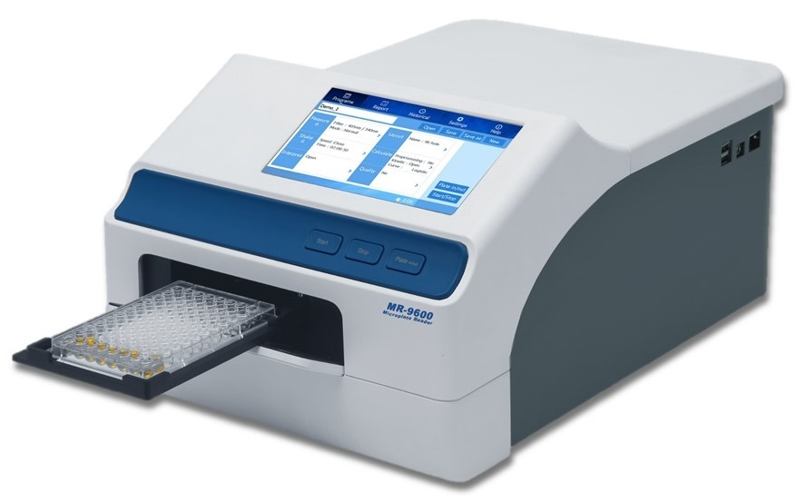

# Tidy Data, Visualisierung und Statistische Größen {#day3}

```{r, include=FALSE}
knitr::opts_chunk$set(eval = FALSE, echo = FALSE)
```

## Wiederholung Tag 2

- Was ist das tidyverse?
- Welche Aufgaben erfüllen die wichtigsten `dplyr` Verben?
- Transfer: Was tut die folgende Codezeile?

```{r, eval=FALSE}
starwars %>%
  group_by(homeworld) %>% 
  mutate(mass = mass / max(mass, na.rm = TRUE))
```

- Was ist ein P-Value?
- Was ist der Unterschied zwischen
  _binomialverteilten_ und _hypergeometrisch verteilten_ Daten?

Zunächst laden wir das tidyverse,
da wir einige Funktionen und auch Beispieldaten daraus verwenden:

```{r}
library(tidyverse)
```

Als Beispiel nehmen wir wieder wieder das Starwars datenset.

```{r, eval=FALSE}
starwars
```

Wenn du die guten alten Spreadsheets vermisst (also Daten angezeigt wie in Excel und Co.),
wirst du die Funktion `View` mögen. Aber auch sonst kann sie sehr hilfreich
sein, falls die Ausgabe der Daten mal nicht ganz in die Konsole passt.

```{r, eval=FALSE}
View(starwars)
```

`select` wählt Spalten aus.
Dies geht über die Namen, aber auch mithilfe sogenanter _select helper_,
über die du in der Hilfe zu `select` mehr erfahren kannst (über `?select`).

```{r}
nur_namen_und_groesse   <- starwars %>% select(name, height)
alle_features_mit_farbe <- select(starwars, ends_with("color"))
das_gleiche_datenset    <- select(starwars, everything())
```

`filter` hingegen filtert Zeilen, und zwar abhängig von
einer beliebigen Zahl an Bedingungen.

```{r}
nur_gerade_massen <- starwars %>% filter(height %% 2 == 0)
nur_blaue_augen   <- starwars %>% filter(eye_color  == "blue")
```

`mutate` fügt neue Spalten hinzu oder modifiziert existierende.

```{r, eval=FALSE}
starwars %>%
  mutate(all_colors = paste(hair_color, skin_color, eye_color)) %>% 
  select(all_colors, everything()) # Trick um die neu Spalte an den Anfang zu schieben
```

`arrange` ordnet die Zeilen abhängig von einer oder mehreren ausgewählten Spalten.
Hier beispielsweise nach absteigender Größe:

```{r, eval=FALSE}
starwars %>% arrange(desc(height)
```

`summamrise` fasst den Dataframe zusammen.

```{r, eval=FALSE}
starwars %>% 
  summarise(mass = mean(mass, na.rm = TRUE),
            height = mean(height, na.rm = TRUE))
```

Wenn der Dataframe vorher gruppiert wurde, operieren `summarise` und
`mutate` entsprechend je innerhalb der Gruppen.

Hier beispielsweise die mittlere Masse pro Heimatplanet:

```{r, eval=FALSE}
starwars %>%
  group_by(homeworld) %>% 
  summarise(mass = mean(mass, na.rm = TRUE))
```

Die oben bereits erwähnte Codezeile

```{r, eval=FALSE}
starwars %>% 
  group_by(homeworld) %>% 
  mutate(mass = mass / max(mass, na.rm = TRUE) )
```

dividiert also jede Masse durch die maximale Masse innerhalb des gleichen
Heimatplaneten.

Zur Definition von P-Values sei auf das vorherige Kapitel unter \@ref(p-values)
verwiesen. Sie werden dir im weiteren Kursverlauf und vorallem auch später
in der Forschung noch häufiger über den Weg laufen.

Zum Unterschied zwischen einer
hypergeometrischen und einer Binomialverteilung:

Die hypergeometrische Verteilung ergibt sich beim Ziehen (_samplen_)
ohne Zurücklegen. Als Beispiel sind in der Dokumentation
von R unter `?rhyper` weiße und schwarze Bälle, die
zufällig aus einer Urne gezogen werden, angegeben.

```{r}
x <- rhyper(10000, m = 50, n =  50, k =  80)
hist(x)
```

Die Binomialverteilung hingegen entspricht dem Ziehen mit Zurücklegen,
oder einfacher gesagt, einer Reihe von Münzwürfen.

```{r}
x <- rbinom(n = 10000, size = 10, prob = 0.5)
hist(x, breaks = 0:10)
```

## Visualisierung als Schlüssel zum Verständnis

### Anscombes Quartet

Und eine Notiz zu _Tidy Data_ und dem `tidyr` package.

```{r}
anscombe
```

Anscombes Quartett ist besonders da:

Gleicher Mittelwert, gleiche Standardabweichung
und der gleiche Korrelationskoeffizient,
obwohl die einzelnen Datensets (1 bis 4) sehr unterschiedlich aussehen.

```{r}
mean(anscombe$x1)
mean(anscombe$x2)
sd(anscombe$x1)
sd(anscombe$x2)
cor(anscombe$x1, anscombe$y1)
cor(anscombe$x2, anscombe$y2)
```

An dieser Stelle ein kleiner Trick aus dem Functional Programming:
Statt wie oben nacheinander beispielsweise den Mittelwert auszurechnen,
kannst du eine Funktion aus der `map`-Familie verwenden,
um eine Funktion (in diesem Fall `mean`) auf alle Elemente einer Liste
anzuwenden. Hierbei gibt `map` immer eine Liste zurück.
Zu jedem Datentyp (z.B. ganze Zahlen _integer_, Kommazahlen _double_)
gibt es zusätzlich noch eine eigen map-Version `map_<datentype>`,
die nur diesen Typ zurückgibt und es damit sicherer zu Programmieren macht,
da Dir Fehler explizit auffallen.

```{r}
map(anscombe, mean) %>% head(2)
```

```{r}
map_dbl(anscombe, mean) %>% head(2)
```

### Exkurs Tidy Data

Tidy Data bedeutet:

> Every row is an observation, every column is a feature

Aber das ist nicht immer leicht.

> "Happy families are all alike; every unhappy family is unhappy in its own way." 
> $-$ Leo Tolstoy

> Tidy datasets are all alike, but every messy dataset is messy in its own way."
> $-$ Hadley Wickham

Im `anscombe` Datensatz versteckt sich ein Feature in
den Spaltennamen! Das `tidyr` Package hilft uns dabei
dieses Feature explizit zu machen.

```{r tidy-data, fig.cap="Following three rules makes a dataset tidy: variables are in columns, observations are in rows, and values are in cells. (Source: R4DS, Hadley Wickham)"}
knitr::include_graphics("img/tidy-1.png")
```

```{r}
anscombe_long <- anscombe %>%
 pivot_longer(everything(),
   names_to = c(".value", "set"),
   names_pattern = "(.)(.)"
 )
```

Jetzt spielt unser Datenset gut mit dem restlichen Tidyverse,
insbesondere ggplot2, zusammen.

```{r}
anscombe_long %>% 
  ggplot(aes(x, y)) +
  geom_point() +
  facet_wrap(~set)
```

```{r}
anscombe_long %>% 
  group_by(set) %>% 
  summarise(m_x = mean(x),
            m_y = mean(y),
            sd_x = sd(x)) 
```


```{r plate-reader-img, echo=FALSE, fig.cap="(Quelle: https://www.stellarscientific.com/accuris-smartreader-96-microplate-absorbance-plate-reader/"}

```


```{r}
# Get the data from github-link
atpase_data <- readxl::read_xlsx("data/04_ATPase_assay.xlsx",
                                 skip = 10,
                                 .name_repair = "universal") %>% 
  select(-Content) %>% 
  rename(time = Time..s.)


# Clean data
clean_data <- atpase_data %>% 
  pivot_longer(starts_with("Sample"),
               names_to = "sample",
               values_to = "absorption") %>% 
  mutate(sample = str_remove(sample, "Sample."))

# visualize data
clean_data %>% 
  ggplot(aes(time, absorption, color = sample)) +
  geom_line()

# normalize data
normalized_data <- clean_data %>% 
  group_by(sample) %>% 
  mutate(absorption = absorption / max(absorption))

# visualize again
normalized_data %>% 
  ggplot(aes(time, absorption, color = sample)) +
  geom_line()

```

Aber was ist noch gleich eine Standardabweichung?

```{r}
# explain mean, SD, SEM based on random numbers from normal distribution
```

$$sd = \sqrt{\frac{\sum_{i=0}^{n}{(x_i-\bar x)^2}}{(n-1)} }$$

Warum n-1?

```{r}
x = c(1,1,3,1)
mean(x)
sd(x)
```

$$var = \sigma^2$$

Standard Error of the Mean (SEM oder SE)

$$SEM=\sigma / \sqrt{n}$$

```{r}
# generate random normal numbers
normal <- rnorm(1000, mean = 0, sd = 1)

# hist
hist(normal)

# mean
mean(normal)

# sd
SD <- sd(normal)

# add lines
abline(v =  SD, col = "red")
abline(v = -SD, col = "red")

# explain percentages within the lines

# sem
sem <- function(x) sd(x) / length(x)
sem(normal)
```

```{r}
curve(dnorm, -5, 5)
```

Quantile-Quantile

```{r}
qqnorm(normal)
qqline(normal, col = "red")
```


### The Datasaurus Dozen

Das Forschungspaper findet ihr [hier](https://www.autodeskresearch.com/publications/samestats)
[@matejka2017a].


```{r}
# install.packages("datasauRus")
```

```{r}
dinos <- datasauRus::box_plots
```

```{r}
dinos <- read_csv("data/datasaurus.csv")
```

```{r}
tidy_dinos <- dinos %>% 
  pivot_longer(
    everything(),
    names_to = "set",
    values_to = "value"
  )
```

Boxplots!


```{r}
tidy_dinos %>% 
  ggplot(aes(set, value)) +
  geom_boxplot()
```


```{r}
# summarise data by set with SD, SEM, mean
```

```{r}
summary_dinos <- tidy_dinos %>% 
  group_by(set) %>% 
  summarise(
    SD    = sd(value),
    SEM   = sem(value),
    value = mean(value)
  )
```


```{r}
# create barplot with errorbars, SD or SEM
summary_dinos %>% 
  ggplot(aes(set, value)) +
  geom_col() +
  geom_errorbar(aes(ymin = value - SD,
                    ymax = value + SD))
```

```{r}
summary_dinos %>% 
  ggplot(aes(set, value)) +
  geom_col() +
  geom_errorbar(aes(ymin = value - SEM,
                    ymax = value + SEM))
```


```{r}
# finally show the point plot and the jitter plot
```

```{r}
tidy_dinos %>% 
  ggplot(aes(set, value)) +
  geom_point(alpha = 0.01)
```

```{r}
tidy_dinos %>% 
  ggplot(aes(set, value)) +
  geom_jitter()
```

Friends don't let friends make barplots!

```{r}
# And make histograms
tidy_dinos %>% 
  ggplot(aes(value, fill = set)) +
  geom_histogram(position = "identity") +
  facet_wrap(~set)
```

```{r}
# And a density plot
tidy_dinos %>% 
  ggplot(aes(value, fill = set)) +
  geom_density() +
  facet_wrap(~set)

```

## Übung

### Inclusion Bodies

Das Datenset lässt sich aus meinem Github Repository herunterladen:

```{r, eval=FALSE}
read_csv("https://raw.githubusercontent.com/jannikbuhr/dataIntro19/master/data/03_inclusion_bodies.csv") %>% 
  write_csv("data/03_inclusion_bodies.csv")
```

Natürlich kannst du auch direkt die Daten über den Link laden,
aber so hast du sie für schlechte Zeiten (sprich: keine Internetverbindung)
gleich gespeichert.

_Disclaimer_: Die Daten stammen aus dem letztjährigen Kurs
und sind echte Daten,
aber ich lüge euch bei der Bedeutung ein
ganz klein wenig an um den biologischen Hintergrund
schneller erklären und sie ohne Probleme veröffentlichen
zu können.

```{r}
# Erklärung Inclusion Bodies
```

- If you want to impress me, do all the exercises
  in a Rmarkdown document, add your conclusions and thoughts
  along with the data analysis process and structure it
  with meaningful headlines using `#`.
- Lies die csv-datei unter `data/03_inclusion_bodies.csv`.
- Mache tidy data daraus
- Visualisiere die Daten (mit ggplot2) als
  - Jittered point plot
  - Boxplot
  - Zwei überlagerte Histogramme (Hinweise: Nutze position = "identity"
    damit R die Histogramme nicht stapelt sondern überlagert)
  - Zwei überlagerte Dichte-Plots (Hinweis: Nutze den Parameter `alpha`
    um beide sichtbar zu machen)
  - Einen Barplot mit Fehlerbalken, Hinweise:
    - Erstelle zunächst einen Zusammenfassungs-Dataframe
    - Nutze `geom_col`, **nicht** `geom_bar`
  - BONUS: Mach die Plots hübsch! (e.g. colors, title,
    caption)

### Lösung

Eine mögliche Lösung zeige ich euch dann nächste Woche flott live,
danach landet der Code hier. Live mache ich das Ganze zur Motivation,
um zu zeigen, wie schnell und effektiv die Datenauswertung laufen kann.


