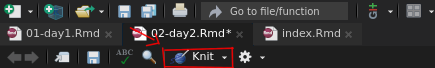
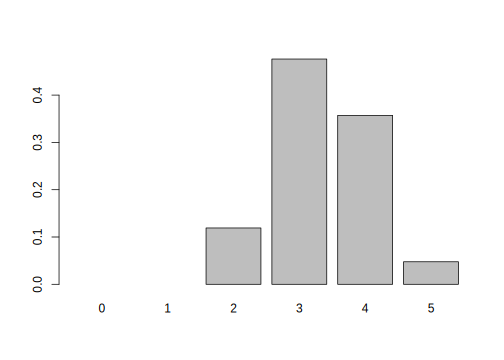
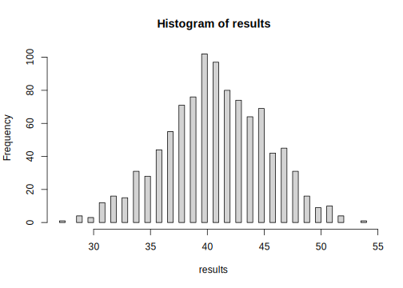

# Bring on the Data! {#day2}

## Project-based Workflow

Whenever you work on a new project (like a lab analysis),
create a new RStudio Project. You can find the quick menu
for this in the top right corner of RStudio.

Projects automatically set your so-called `working directory`
to this project folder. This is where R will search for
files and save files to. Every file path should be relative
to this working directory. This also enables the RStudio autocompletion
to help you find your files. Inserting a pair of quotations marks (`"`)
into your code and pressing Tab or Ctrl+Space shows you the files
and folders in your working directory.

### Workflow of a Data Analysis

A typical workflow according to Hadley Wickam, Chief Scientist at
RStudio:

<div class="figure">

<p class="caption">(\#fig:workflow-img)Source: @wickhamDataScienceImport2017</p>
</div>


### Communication!

Your thoughts during data analysis matter (To future-you and others)! 

This is one of the main reasons I use Rmarkdown
instead of R scripts for teaching, as well
as regular data analysis. This `.Rmd` format mixes
text with code _chunks_. You can create your own
in the top left corner of RStudio. Choose "R markdown" and press OK.

<!-- -->

This will present you with an example document showcasing
some of the possibilities. A plethora of information can be found
in the official
[Rmarkdown guide](https://bookdown.org/yihui/rmarkdown/) [@R-rmarkdown].

Text is interpreted as markdown, with special characters to mark
text as bold, italics, a heading etc. and text in so called
code chunks is interpreted as (R) code. You can insert R code chunks
with the shortcut Ctrl+Alt+I or the button in the upper right corner
of the code editor window. To execute (= send to the console) a piece
of code in a chunk hit the familiar Ctrl+Enter. To Execute 

Hitting the **knit** button will run the whole document and produce
a report in the specified format (html, docx, pdf and many others).

<!-- -->

### Important RStudio-Settings

For the sake of reproducibility, please set these settings
(Tools -> Global Options) in your RStudio.

<div class="figure">

<p class="caption">(\#fig:unnamed-chunk-3)RStudio Settings</p>
</div>

## Packages: The Tidyverse

This is where a lot of the power of R comes from.

Packages are...

Installing packages


```r
# install tidyverse
install.packages("tidyverse")
```

Load packages:


```r
# load tidyverse
library(tidyverse)
```

```
## ── Attaching packages ────────
```

```
## ✓ ggplot2 3.3.2     ✓ purrr   0.3.4
## ✓ tibble  3.0.3     ✓ dplyr   1.0.1
## ✓ tidyr   1.1.1     ✓ stringr 1.4.0
## ✓ readr   1.3.1     ✓ forcats 0.5.0
```

```
## ── Conflicts ─────────────────
## x dplyr::filter() masks stats::filter()
## x dplyr::lag()    masks stats::lag()
```

The tidyverse is

## Exercise from day 1

### Questions

- What do we get when we execute `c("12", 13, 14)[2] + 1`?
  - Try do predict what will happen before executing the code.
  - Why does it happen that way?
- Make a vector x with the numbers from 1 to 10
- Make a vector y with the same content as x
- Plot both vectors as points (y ~ x)
  - hint: use the `plot` function
- Do a linear regression and add it as a line to the plot
- How can we find out more about the linear regression object?

### Answers


```r
c("12", 13, 14)[2] + 1
vec <- c("12", 13, 14)
vec[2]
vec[2] + 1
```

Ctrl+Shift+Enter to run the whole chunk


```r
x <- 1:10
y <- x
# plot(x, y)
plot(y ~ x)
linearModel <- lm(y ~ x)
abline(linearModel)
```


## Reading data

The `readr`-package is part of the `tidyverse`,
which we already loaded above with `library(tidyverse)`.

Take your favourite table calculation program (Excel, Libre Office).
We create a list of course participants and at the same
time note the row in which they are sitting and their hair length.

We can save the file as `.csv` (Comma Separated Values),
which is a plain text file and can be opened
with any text editor. As a destination we
create a folder in our project called `data`,
to keep everything organized.


```r
read_csv("data/students.csv")
```

You might have a German Excel version... 
Because the German language uses
the comma as a decimal separator, it can't use
the comma to separate entries in a table as well.
This is why the German version of a "csv" produced
by Excel is actually semicolon (`;`) separated.
But there is an easy fix for that:


```r
read_csv2("data/students.csv")
```

Both `read_csv...` functions are just special
cased of `read_delim`, where any character can
be specified to separate entries, not just commata
or semicolons:


```r
# read_csv equals
read_delim("data/students.csv", delim = ",")

# read_csv2 equals
read_delim("data/students.csv", delim = ";")
```

If you are not sure what function to use, open the file
in a regular text editor like notepad and have a look.

You can also read straight from excel files.


```r
readxl::read_excel("data/students.xlsx")
```

Up until now we only looked at the results of
calling the read-functions but we didn't assign
the data to a variable so that we can use it.
Let us do so now:


```r
students <- read_csv("data/students.csv")
```

```
## Parsed with column specification:
## cols(
##   name = col_character(),
##   row = col_double(),
##   hairlength = col_character()
## )
```

You can view your data in a new tab in RStudio.


```r
View(students)
```

Or simply look at the content of our variable students:


```r
students
```

```
## # A tibble: 10 x 3
##    name        row hairlength
##    <chr>     <dbl> <chr>     
##  1 jannik        0 s         
##  2 ulrich        1 s         
##  3 lea           1 l         
##  4 melanie       1 l         
##  5 judith        1 l         
##  6 maria         1 l         
##  7 alex          2 s         
##  8 christina     2 l         
##  9 jan           2 s         
## 10 pamina        2 l
```

Writing data works analogous to that.


```r
write_csv(students, path = "data/students2.csv")
```

Now what do we do with the data?

## The Pipe and dplyr Verbs

The `dplyr` package and the pipe (`%>%`)

### The Pipe

Data needs to be processed.
Functions that process data are used sequentially.
The common way (in other languages) to write this
looks about like this:

First we define some toy functions.


```r
addOne <- function(x) x + 1
standardize <- function(x) x / max(x)
callOutResult <- function(x) paste("Your result is", x)
```

Then we use them with our example data,
which is just the numbers from 1 to 5.


```r
data <- 1:5
newData <- addOne(data)
evenNewerData <- standardize(newData)
callOutResult(evenNewerData)
```

```
## [1] "Your result is 0.333333333333333" "Your result is 0.5"              
## [3] "Your result is 0.666666666666667" "Your result is 0.833333333333333"
## [5] "Your result is 1"
```

This is not fun to write! We might want to
overwrite our original data instead of 
creating a new variable for every step.


```r
data <- 1:5
data <- addOne(data)
data <- standardize(data)
callOutResult(data)
```

```
## [1] "Your result is 0.333333333333333" "Your result is 0.5"              
## [3] "Your result is 0.666666666666667" "Your result is 0.833333333333333"
## [5] "Your result is 1"
```

This is a lot of repetition!
Who wants to type `data` that often?
Maybe we turn to math notation with brackets?


```r
data <- 1:5
callOutResult(standardize(addOne(data)))
```

```
## [1] "Your result is 0.333333333333333" "Your result is 0.5"              
## [3] "Your result is 0.666666666666667" "Your result is 0.833333333333333"
## [5] "Your result is 1"
```

This is certainly not pretty. Enter: The pipe `%>%`.

> Insert a pipe with Ctrl+Shift+M
  (Or manually type it out)

The pipe enables us to pass the result of one function
on to the next function.
With pure functions `g` and `f`, the following
semi-mathematical equation holds true:

`f(g(x)) = x %>% g() %>% f()`


```r
data <- 1:5
data %>% addOne() %>% standardize() %>% callOutResult()
```

```
## [1] "Your result is 0.333333333333333" "Your result is 0.5"              
## [3] "Your result is 0.666666666666667" "Your result is 0.833333333333333"
## [5] "Your result is 1"
```

We can also write each step on a new line
(because R doesn't care about new lines).


```r
data %>% 
  addOne() %>% 
  standardize() %>% 
  callOutResult()
```

```
## [1] "Your result is 0.333333333333333" "Your result is 0.5"              
## [3] "Your result is 0.666666666666667" "Your result is 0.833333333333333"
## [5] "Your result is 1"
```

For functions with more than one argument,
the pipe inserts the _stuff_ from the left hand side (LHS)
as the first argument to the function!


```r
addNumber <- function(x, number) x + number
```


```r
data %>% addNumber(3)
```

```
## [1] 4 5 6 7 8
```

### Overview of the dplyr Verbs

These are the main functions we use to
transform and process our data after
we brought it into R with the `readr` package.

These functions work on `data.frames`, or
the slightly more modern version of the `data.frame`
that the `tidyverse` calls a `tibble` (like table).

These functions are:

- `select`
- `filter`
- `arrange`
- `mutate`
- `summarise`
- `count`
- And additionally the adverb: `group_by`

### select

Select columns of a `data.frame` (or `tibble`).

Remember the "base-R" way to select columns?


```r
students[, c("name", "row")]
```

The `select`  function replaces this:


```r
select(students, name, row)

# or in a pipe
students %>% select(name, row)
```

### filter

Filter a `tibble` based on conditions applied to columns.

Remember the old way to subset?


```r
students[students$row == 1, ]
```

The new syntax is more straightforward:


```r
students %>% 
  filter(row == 1)
```

And can be combined in pipes:


```r
students %>% 
  filter(row == 1) %>% 
  select(name)
```

This new expression gives the same result as the base-R way
of writing `students[students$row == 1, 1]` but is easier to read.

The conditions in filter stack.


```r
students %>% 
  filter(row == 2, hairlength == "l")
```

```
## # A tibble: 2 x 3
##   name        row hairlength
##   <chr>     <dbl> <chr>     
## 1 christina     2 l         
## 2 pamina        2 l
```

We can also combine conditions with or ( | )


```r
students %>%
  filter(row == 2 | hairlength == "l")
```

```
## # A tibble: 8 x 3
##   name        row hairlength
##   <chr>     <dbl> <chr>     
## 1 lea           1 l         
## 2 melanie       1 l         
## 3 judith        1 l         
## 4 maria         1 l         
## 5 alex          2 s         
## 6 christina     2 l         
## 7 jan           2 s         
## 8 pamina        2 l
```

> One thing to note: As of now, we have not changed the students data!
  because we only looked at the output of the functions in the console
  and did not assign anything (with <- ).

### mutate

To Change a column or add a new one e.g. the length of your names.
Last week in base R, adding a column worked
like that:


```r
students$nameLength <- str_length(students$name)
```

But with the `mutate` function, it gets more
readable. Note, that we do not refer to
`students$name` explicitly inside of `mutate`.
`mutate` knows that `name` is referring to a column of
the tibble passed into the function from the left.
Furthermore, there is an equal sign (`=`) in there,
because everything inside of mutate is a parameter
to the function, it is **not** an assignment (`<-`).


```r
students %>% 
  mutate(nameLength = str_length(name))
```

We might need this modified/enhanced data later,
so let's  overwrite the variable `students`:


```r
students <- students %>%  
  mutate(nameLength = str_length(name))
```


```r
head(students)
```

```
## # A tibble: 6 x 4
##   name      row hairlength nameLength
##   <chr>   <dbl> <chr>           <int>
## 1 jannik      0 s                   6
## 2 ulrich      1 s                   6
## 3 lea         1 l                   3
## 4 melanie     1 l                   7
## 5 judith      1 l                   6
## 6 maria       1 l                   5
```

### arrange

> Who has the longest name?


```r
students %>% 
  arrange(desc(nameLength)) %>% 
  head()
```

```
## # A tibble: 6 x 4
##   name        row hairlength nameLength
##   <chr>     <dbl> <chr>           <int>
## 1 christina     2 l                   9
## 2 melanie       1 l                   7
## 3 jannik        0 s                   6
## 4 ulrich        1 s                   6
## 5 judith        1 l                   6
## 6 pamina        2 l                   6
```

This could have been achieved with `filter` as well:


```r
students %>% 
  filter(nameLength == max(nameLength))
```

```
## # A tibble: 1 x 4
##   name        row hairlength nameLength
##   <chr>     <dbl> <chr>           <int>
## 1 christina     2 l                   9
```

Note that the `dplyr` functions always return tibbles,
not the raw vectors. But we can pull out a tibble
column as a vector:


```r
students %>% 
  filter(nameLength == max(nameLength)) %>% 
  pull(name)
```

```
## [1] "christina"
```

### count

> How many are in the first row?


```r
students %>% count(row)
```

```
## # A tibble: 3 x 2
##     row     n
##   <dbl> <int>
## 1     0     1
## 2     1     5
## 3     2     4
```

> How many based on hairlength?


```r
students %>% count(row, hairlength)
```

```
## # A tibble: 5 x 3
##     row hairlength     n
##   <dbl> <chr>      <int>
## 1     0 s              1
## 2     1 l              4
## 3     1 s              1
## 4     2 l              2
## 5     2 s              2
```

### summarise

> What is the mean name-length?

In base-R, we would have operated on the column of
the tibble extracted as a vector with he `$`-operator.


```r
mean(students$nameLength)
```

```
## [1] 5.5
```

But in the tidyverse, we can work directly with the tibble.


```r
students %>% 
  summarise(nameLength = mean(nameLength))
```

```
## # A tibble: 1 x 1
##   nameLength
##        <dbl>
## 1        5.5
```

### group_by und summarise

> Do participants in the first row have longer names?

`group_by` is an adverb because by itself, it doesn't
do anything to the data, but it changes the way the
other `dplyr` verbs operate. Any function that
summarizes a vector, like `mean`, `sum`, `max`,
now operates on the groups.


```r
students %>% 
  group_by(row) %>% 
  summarise(nameLengh = mean(nameLength))
```

```
## `summarise()` ungrouping output (override with `.groups` argument)
```

```
## # A tibble: 3 x 2
##     row nameLengh
##   <dbl>     <dbl>
## 1     0       6  
## 2     1       5.4
## 3     2       5.5
```


```r
students %>% 
  group_by(row, hairlength) %>% 
  summarise(nameLength = mean(nameLength)) %>% 
  arrange(desc(nameLength))
```

```
## `summarise()` regrouping output by 'row' (override with `.groups` argument)
```

```
## # A tibble: 5 x 3
##     row hairlength nameLength
##   <dbl> <chr>           <dbl>
## 1     2 l                7.5 
## 2     0 s                6   
## 3     1 s                6   
## 4     1 l                5.25
## 5     2 s                3.5
```

> Do people with long hair tend to sit in the first row?


```r
students %>% 
  filter(row != 0) %>% 
  count(row, hairlength)
```

```
## # A tibble: 4 x 3
##     row hairlength     n
##   <dbl> <chr>      <int>
## 1     1 l              4
## 2     1 s              1
## 3     2 l              2
## 4     2 s              2
```

#### Sidenotes

`pull` pulls out a column of a tibble as a vector.


```r
students %>% 
  pull(name)
```

```
##  [1] "jannik"    "ulrich"    "lea"       "melanie"   "judith"    "maria"    
##  [7] "alex"      "christina" "jan"       "pamina"
```

### Moving on to Probability

The question we might ask now is:

> If every person were randomly seated,
  What would be the probability to find
  that many people (or more) with long hair
  in the first row?

## But what is Probability?

There are two concepts of probability ($P$):

- Probability inside your head: strength of belief;
  may vary among people
- Probability „out there“: long-term frequency of an event;
  can be empirically measured or predicted from a model [@motulsky2017].

We will be concerned with the latter.

### Example:

Categorical / discrete data: _Drawing (blindly) from a hat._


```r
students %>% 
  count(row, hairlength)
```

```
## # A tibble: 5 x 3
##     row hairlength     n
##   <dbl> <chr>      <int>
## 1     0 s              1
## 2     1 l              4
## 3     1 s              1
## 4     2 l              2
## 5     2 s              2
```


```r
students %>%
  filter(row != 0) %>% 
  count(hairlength)
```

```
## # A tibble: 2 x 2
##   hairlength     n
##   <chr>      <int>
## 1 l              6
## 2 s              3
```

***

**Note**

> This example uses a lot of base-R functions and
  less tidyverse style. Try to dicern between the
  use of normal vectors like in the following code
  and tibbles as observed in the tidyverse.

***

We create a "hat" of hairlengths with the numbers observed in our course.


```r
hat <- c( rep("l", 6), rep("s", 3) ) # rep stands for repeat
hat
```

```
## [1] "l" "l" "l" "l" "l" "l" "s" "s" "s"
```

And sample / draw blindly from said hat


```r
sample(hat, 1)
```

```
## [1] "s"
```

Now we sample the same number of hairlenghts
from the hat as the number of people sitting
in the first row:


```r
firstRow <- sample(hat, 5)
```

This is representative of people coming
into the room and getting seated randomly.

> Note that the default for sample is `replace = FALSE`
  (see `?sample`), so the same person can only
  be seated once. It does not return to the hat to
  be drawn again.
  
How many in this sample have long hair?


```r
sum(firstRow == "l")
```

```
## [1] 4
```

What fraction?


```r
# this works because `mean` converts TRUE to 1 and FALSE to 0
mean(firstRow == "l") 
```

```
## [1] 0.8
```

We can simulate this draw a bunch of times,
as if people were coming into the room over and over
again, each time getting seated randomly. For this,
we use a `for` loop. This loop executes the
code between the curly braces once for every
element of the vector ` 1:5`. The current element
of every iteration is called `i` in this case.


```r
for (i in 1:5) {
  print(i)
}
```

```
## [1] 1
## [1] 2
## [1] 3
## [1] 4
## [1] 5
```

We use this concept to simulate drawing 1000 times,
each time calculating the number of people with
long hair in the first row.


```r
N <- 1000

# create vector for the sum from each draw
results <- 1:N

# assign the results in a loop
for (i in 1:N) {
  draw <- sample(hat, 5)
  results[i] <- sum(draw == "l")
}
```

The histogram shows us, how often each number
appears in our results.


```r
hist(results, breaks = 0:5)
```


How surprised should we be, that in our real world
data, we found this number of long haired people
in the first row? Well, let us check how often
we got that many or more in our simulated data.


```r
#  -> Calculate probability for random event
# sum greater than or equal to observed frequency / length
mean(results >= 4)
```

```
## [1] 0.445
```

So in 44.5 % of cases in our simulation,
we got 4 or more people with long hair in the first row.
This means, that the observed result is quite likely to occur
just by chance. We can **not** prove that it did indeed
resulted just from chance alone, but we can show that if it is just
random chance, we are not very surprised to see a result
like this in our data.

### P-Values {#p-values}

P-Values were introduced in the 1920s by Ronald Fisher:

> _"The P value is defined as the probability, under the assumption of
  no effect or no difference (the null hypothesis),
  of obtaining a result equal to or more extreme
  than what was actually observed."_
> $-$ (Original: [Statistical Methods for Research Workers](https://en.wikipedia.org/wiki/Statistical_Methods_for_Research_Workers)) [@fisher1990]

By convention: p ≤ 0.05 is called "significant".
In other words, a p-Value is...

> _"... a measure of how surprised you should be
  if there is no actual difference […],
  but you got data suggesting there is"_
>  $-$ Alex Reinhart [@reinhart2015]

We can calculate the exact p-value of our example
with the hypergeometric distribution.


```r
# note that it calculates cumulative probabilities!
# default: P(X <= x)
1 - phyper(q = 3, m = 6, n = 3, k = 5)
```

```
## [1] 0.4047619
```

It is quite close to our simulation! And had we used a higher `N`,
like 1'000'000, it would of course be even closer.

The hypergeometric distribution for for our example
looks as follows


```r
barplot(dhyper(x = 0:5, m = 6, n = 3, k =  5), names.arg = 0:5)
```

<div class="figure">

<p class="caption">(\#fig:dhyper-bar)Hypergeometric distribution for people with long hair in the first row with random seating.</p>
</div>

## Exercise: Transfer to new Data

Starwars, a dataset that comes with the tidyverse.


```r
?starwars
```

- In a new Rmarkdown document:
- Preview the dataset
- Select the columns name, height, mass, gender
- Who is the heaviest?
- Convert height from cm to m
- Which gender is taller on average in starwars?
  - _Hint:_ use `group_by` and `summarise`
  - You will need the argument `na.rm = TRUE` in `mean()`

- Simulate drawing 81 characters (or rather genders) from a hat.
- Repeat this 1000 times (with a for-loop).
- How often do you obtain 62 or more male characters?
- How surprised should we be about the data?
- Calculate an exact p-value for the observed frequency
  - note: use pbinom instead of phyper to sample WITH replacement
- Knit the document into a report

### Solutions

**Live on Friday**

#### First, we load packages and Data


```r
library(tidyverse)
```


```r
starwars %>% select(name, mass, height, gender) %>% head()
```

```
## # A tibble: 6 x 4
##   name            mass height gender   
##   <chr>          <dbl>  <int> <chr>    
## 1 Luke Skywalker    77    172 masculine
## 2 C-3PO             75    167 masculine
## 3 R2-D2             32     96 masculine
## 4 Darth Vader      136    202 masculine
## 5 Leia Organa       49    150 feminine 
## 6 Owen Lars        120    178 masculine
```

Sidenote: to put a column in the front:


```r
starwars %>% select(gender, everything() ) %>% head()
```

```
## # A tibble: 6 x 14
##   gender name  height  mass hair_color skin_color eye_color birth_year sex  
##   <chr>  <chr>  <int> <dbl> <chr>      <chr>      <chr>          <dbl> <chr>
## 1 mascu… Luke…    172    77 blond      fair       blue            19   male 
## 2 mascu… C-3PO    167    75 <NA>       gold       yellow         112   none 
## 3 mascu… R2-D2     96    32 <NA>       white, bl… red             33   none 
## 4 mascu… Dart…    202   136 none       white      yellow          41.9 male 
## 5 femin… Leia…    150    49 brown      light      brown           19   fema…
## 6 mascu… Owen…    178   120 brown, gr… light      blue            52   male 
## # … with 5 more variables: homeworld <chr>, species <chr>, films <list>,
## #   vehicles <list>, starships <list>
```

Height is not in SI units! But we love SI units!
So we convert height from cm to meter.


```r
starwars <- starwars %>% 
  mutate(height = height / 100)
```

  

```r
View(starwars)
```


```r
starwars %>% 
  arrange(desc(mass)) %>%
  head()
```

```
## # A tibble: 6 x 14
##   name  height  mass hair_color skin_color eye_color birth_year sex   gender
##   <chr>  <dbl> <dbl> <chr>      <chr>      <chr>          <dbl> <chr> <chr> 
## 1 Jabb…   1.75  1358 <NA>       green-tan… orange         600   herm… mascu…
## 2 Grie…   2.16   159 none       brown, wh… green, y…       NA   male  mascu…
## 3 IG-88   2      140 none       metal      red             15   none  mascu…
## 4 Dart…   2.02   136 none       white      yellow          41.9 male  mascu…
## 5 Tarf…   2.34   136 brown      brown      blue            NA   male  mascu…
## 6 Owen…   1.78   120 brown, gr… light      blue            52   male  mascu…
## # … with 5 more variables: homeworld <chr>, species <chr>, films <list>,
## #   vehicles <list>, starships <list>
```


```r
starwars %>% 
  filter(mass == max(mass, na.rm = TRUE)) %>%
  head()
```

```
## # A tibble: 1 x 14
##   name  height  mass hair_color skin_color eye_color birth_year sex   gender
##   <chr>  <dbl> <dbl> <chr>      <chr>      <chr>          <dbl> <chr> <chr> 
## 1 Jabb…   1.75  1358 <NA>       green-tan… orange           600 herm… mascu…
## # … with 5 more variables: homeworld <chr>, species <chr>, films <list>,
## #   vehicles <list>, starships <list>
```


```r
starwars %>% 
  filter(mass == max(mass, na.rm = TRUE)) %>% 
  pull(name)
```

```
## [1] "Jabba Desilijic Tiure"
```


- Who is the heaviest?
- Convert height from cm to m
- Which gender is taller on average in starwars?
  - _Hint:_ use `group_by` and `summarise`
  - You will need the argument `na.rm = TRUE` in `mean()`
  
  

```r
starwars %>% 
  group_by(gender) %>% 
  summarise(height = mean(height, na.rm = TRUE),
            N = n()) %>%
  head()
```

```
## `summarise()` ungrouping output (override with `.groups` argument)
```

```
## # A tibble: 3 x 3
##   gender    height     N
##   <chr>      <dbl> <int>
## 1 feminine    1.65    17
## 2 masculine   1.77    66
## 3 <NA>        1.81     4
```
  

- Simulate drawing 81 characters (or rather genders) from a hat.
- Repeat this 1000 times (with a for-loop).
- How often do you obtain 62 or more male characters?
- How surprised should we be about the data?
- Calculate an exact p-value for the observed frequency
  - note: use `pbinom` instead of `phyper` to sample WITH replacement
- Knit the document into a report


```r
hat <- c("male", "others")
sample(hat, 84, replace = TRUE, prob = c(0.49, 0.51))
```

```
##  [1] "male"   "male"   "male"   "others" "male"   "others" "others" "male"  
##  [9] "others" "male"   "others" "male"   "others" "others" "others" "male"  
## [17] "others" "male"   "male"   "male"   "others" "others" "others" "others"
## [25] "others" "male"   "male"   "others" "others" "male"   "others" "others"
## [33] "others" "male"   "others" "male"   "male"   "male"   "others" "others"
## [41] "others" "male"   "others" "male"   "male"   "male"   "others" "male"  
## [49] "male"   "others" "others" "male"   "others" "male"   "male"   "male"  
## [57] "others" "others" "male"   "male"   "others" "others" "others" "others"
## [65] "male"   "male"   "male"   "others" "others" "male"   "male"   "others"
## [73] "male"   "male"   "male"   "others" "male"   "male"   "male"   "male"  
## [81] "male"   "male"   "male"   "male"
```


```r
hat <- c("male", "others")

results <- 1:1000
for (i in 1:1000) {
  draw <- sample(hat, 84, replace = TRUE, prob = c(0.49, 0.51))
  results[i] <- sum(draw == "male")
}
hist(results, breaks = 40)
```




```r
sum(results >= 62)
```

```
## [1] 0
```

```r
mean(results >= 62)
```

```
## [1] 0
```


```r
pbinom(q = 62 - 1, size = 84, prob = 0.49, lower.tail = FALSE)
```

```
## [1] 3.176077e-06
```


[Seeing Theory](https://seeing-theory.brown.edu/index.html)


