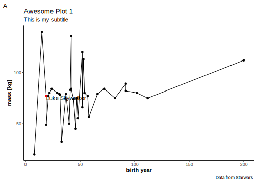
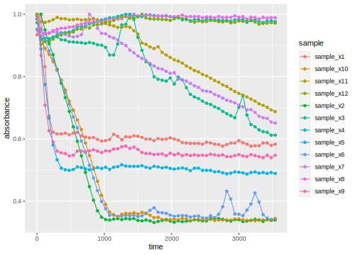
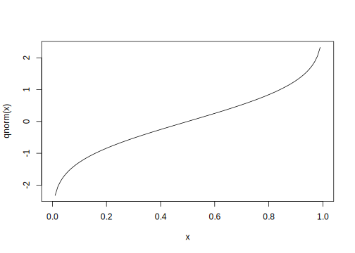
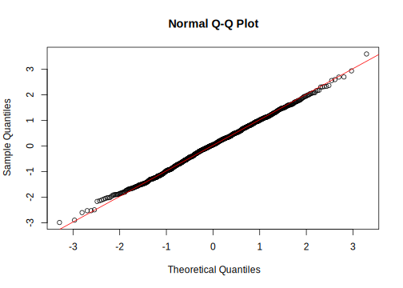
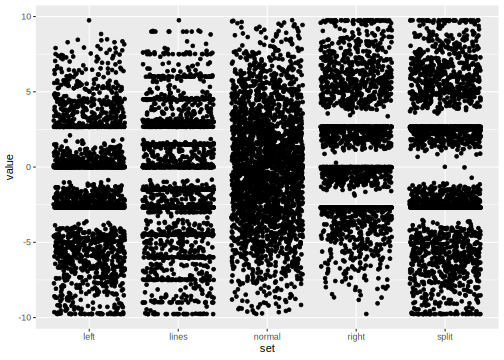
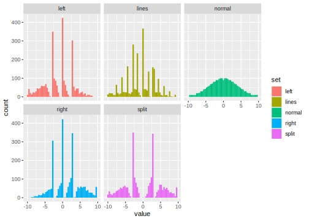

# Tidy Data, Visualization and Distributions {#day3}

We will be using functions and data from the
`tidyverse` today, so lets load it.
It is good practice to have all library loading
and data import steps at the beginning of your
document.


```r
library(tidyverse)
```

```
## ── Attaching packages ────────
```

```
## ✓ ggplot2 3.3.2     ✓ purrr   0.3.4
## ✓ tibble  3.0.3     ✓ dplyr   1.0.1
## ✓ tidyr   1.1.1     ✓ stringr 1.4.0
## ✓ readr   1.3.1     ✓ forcats 0.5.0
```

```
## ── Conflicts ─────────────────
## x dplyr::filter() masks stats::filter()
## x dplyr::lag()    masks stats::lag()
```

## Recap of day 2

### Questions

- What is the `tidyverse`?
- What are the most important `dplyr` verbs and their function?
- Transfer: What do the following lines do?


```r
starwars %>%
  group_by(homeworld) %>% 
  mutate(mass = mass / max(mass, na.rm = TRUE)) %>% 
  filter(homeworld == "Tatooine")
```

- What is a p-value?
- What is the difference between
  _binomially_ and _hypergeometrically_ distributed data?

### Answers

#### dplyr

We use the `starwars` dataset to demonstrate the answers.

`select` to select columns!


```r
select(starwars, name, height)
```

`filter` to ask for specific rows based on a condition.


```r
filter(starwars, mass > 100)
```

`mutate` to add columns or modify existing columns.


```r
mutate(starwars, NewHeight = height * 2)
```

Renaming columns works with `rename` but also inside
of `select`.


```r
starwars %>%
  rename(character = name) %>% 
  select(biggness = mass, character, height) %>% 
  head(1)
```

```
## # A tibble: 1 x 3
##   biggness character      height
##      <dbl> <chr>           <int>
## 1       77 Luke Skywalker    172
```

`arrange` to sort based on a column.


```r
starwars %>% arrange(mass)
```

`summarize` to summarize columns down to
a single value per column (note, that the tidyverse accepts
American and British English, both functions exist).


```r
starwars %>% summarize(max(height, na.rm = TRUE),
                       min(mass, na.rm = TRUE))
```

```
## # A tibble: 1 x 2
##   `max(height, na.rm = TRUE)` `min(mass, na.rm = TRUE)`
##                         <int>                     <dbl>
## 1                         264                        15
```

It is best to give names to the arguments, so we write it
as:


```r
starwars %>% summarize(MaxHeight = max(height, na.rm = TRUE),
                       MinMass   =  min(mass, na.rm = TRUE))
```

```
## # A tibble: 1 x 2
##   MaxHeight MinMass
##       <int>   <dbl>
## 1       264      15
```

`group_by` and `summarise` to summarise **within**
each group in the grouping column(s):


```r
starwars %>% 
  group_by(homeworld) %>% 
  summarise(mass = mean(mass, na.rm = TRUE)) %>% 
  head(3)
```

```
## `summarise()` ungrouping output (override with `.groups` argument)
```

```
## # A tibble: 3 x 2
##   homeworld    mass
##   <chr>       <dbl>
## 1 Alderaan       64
## 2 Aleen Minor    15
## 3 Bespin         79
```

Running the code in the first question
thus demonstrates, how to normalize 
the mass to the maximum mass in each homeworld.
For example, _Luke Skywalker_ weights 56% as much
as the heaviest person from his planet, while
_Darth Vader_ is the heaviest person on his planet
(that made it into this dataset).


```r
starwars %>% 
  filter(!is.na(mass)) %>% 
  group_by(homeworld) %>% 
  mutate(mass = mass / max(mass) ) %>% 
  select(name, height, mass, homeworld) %>% 
  head(4)
```

```
## # A tibble: 4 x 4
##   name           height  mass homeworld
##   <chr>           <int> <dbl> <chr>    
## 1 Luke Skywalker    172 0.566 Tatooine 
## 2 C-3PO             167 0.551 Tatooine 
## 3 R2-D2              96 0.376 Naboo    
## 4 Darth Vader       202 1     Tatooine
```

#### Statistics

For the definition of p-values, check out chapter \@ref(p-values).

The hypergeometric distribution is for sampling without replacement.


```r
x <- rhyper(10000, m = 50, n =  50, k =  80)
hist(x)
```


The binomial distribution is for sampling **with** replacement
(Like tossing a coin to your witcher).


```r
x <- rbinom(n = 10000, size = 10, prob = 0.5)
hist(x, breaks = 0:10)
```


## Visualization with ggplot2

### The Grammar of Graphics 

The idea of a "grammar of graphics" was
first introduced by Leland Wilkinson [@wilkinsonGrammarGraphics2005].
It enables us to describe graphics (data visualizations)
in terms of relatively simple building blocks.

Hadley Wickham took this idea and translated
it with slight modifications into an R package
[@wickhamLayeredGrammarGraphics2010].
Understanding the individual building blocks
and their grammar (how they connect) allows
us to create intricate visualizations that
can be iterated on with great speed
without learning a different set of rules
for each type of visualization.

So, what makes up a graph?


```r
starwars %>% 
  filter(mass < 500, !is.na(birth_year)) %>% 
  ggplot(aes(x = height,
             y = mass,
             color = gender)) +
  geom_point(aes(size = birth_year))
```


The building ground for our visualization is data.
We then decide on some features in the data (like height,
mass, gender and birth year) and map them to an aesthetic property.
This is what happens inside the `aes` function as the
`mapping` argument to `ggplot`. Height for example is mapped
to the x-axis whereas gender is mapped to the color.
"The color of what?", you might ask, and rightfully so.
There is no visualization without geometric objects
to represent those aesthetics. This is where the functions
starting with `geom_` come into play. We add them
to our plot with the `+` operator. Here, we use `geom_point()`
to add points to our plot. This is a good fit
because one point can represent several dimensions
of our data at the same time (like, height as the x position,
mass as the y position etc.). Other pieces of the grammar
of graphics are not handled explicitly in the code above
because the defaults work just fine. But they are handled
nonetheless in the background: Scales define
how exactly the data is mapped to aesthetics and can be modified
with functions starting with `scale_` (like
`scale_color_...` to change the colors used in the color
aesthetic, or `scale_x_log10()` to apply a logarithmic scale
to the x-axis). Lastly, the objects with their
scales need to placed on a coordinate system, like
the default cartesian coordinates in the above example.

> Data => Aesthetic Mapping =>
  Scales => (Statistical Transformation) =>
  Geometric Objects => Coordinate System =>

Instead of displaying the plot straight away, we
can save it to a variable:


```r
plt1 <- starwars %>% 
  filter(mass < 500, !is.na(birth_year)) %>% 
  ggplot(aes(x = height,
             y = mass,
             color = gender,
             label = name)) +
  geom_point(aes(size = birth_year))
```

And then display it later


```r
plt1 # not run
```

Or pass it to other functions,
like the handy `ggplotly` function
from the `plotly` package, that creates
and interactive java script visualization
from a normal ggplot object:


```r
plotly::ggplotly(plt1)
```

<!--html_preserve--><div id="htmlwidget-82b5c2d25939284de40e" style="width:672px;height:480px;" class="plotly html-widget"></div>
<script type="application/json" data-for="htmlwidget-82b5c2d25939284de40e">{"x":{"data":[{"x":[150,165,178,170,166,165],"y":[49,75,55,56.2,50,45],"text":["birth_year:  19.0<br />height: 150<br />mass:  49.0<br />gender: feminine<br />name: Leia Organa","birth_year:  47.0<br />height: 165<br />mass:  75.0<br />gender: feminine<br />name: Beru Whitesun lars","birth_year:  48.0<br />height: 178<br />mass:  55.0<br />gender: feminine<br />name: Ayla Secura","birth_year:  58.0<br />height: 170<br />mass:  56.2<br />gender: feminine<br />name: Luminara Unduli","birth_year:  40.0<br />height: 166<br />mass:  50.0<br />gender: feminine<br />name: Barriss Offee","birth_year:  46.0<br />height: 165<br />mass:  45.0<br />gender: feminine<br />name: Padmé Amidala"],"type":"scatter","mode":"markers","marker":{"autocolorscale":false,"color":"rgba(248,118,109,1)","opacity":1,"size":[5.88280895519997,7.7398754848106,7.79032781081583,8.26373856261023,7.36689636189921,7.68877208025709],"symbol":"circle","line":{"width":1.88976377952756,"color":"rgba(248,118,109,1)"}},"hoveron":"points","name":"feminine","legendgroup":"feminine","showlegend":true,"xaxis":"x","yaxis":"y","hoverinfo":"text","frame":null},{"x":[172,167,96,202,178,183,182,188,228,180,173,170,66,170,183,200,190,177,175,180,88,193,196,175,188,198,188,193,183],"y":[77,75,32,136,120,84,77,84,112,80,74,77,17,75,78.2,140,113,79,79,83,20,89,66,80,84,82,80,80,79],"text":["birth_year:  19.0<br />height: 172<br />mass:  77.0<br />gender: masculine<br />name: Luke Skywalker","birth_year: 112.0<br />height: 167<br />mass:  75.0<br />gender: masculine<br />name: C-3PO","birth_year:  33.0<br />height:  96<br />mass:  32.0<br />gender: masculine<br />name: R2-D2","birth_year:  41.9<br />height: 202<br />mass: 136.0<br />gender: masculine<br />name: Darth Vader","birth_year:  52.0<br />height: 178<br />mass: 120.0<br />gender: masculine<br />name: Owen Lars","birth_year:  24.0<br />height: 183<br />mass:  84.0<br />gender: masculine<br />name: Biggs Darklighter","birth_year:  57.0<br />height: 182<br />mass:  77.0<br />gender: masculine<br />name: Obi-Wan Kenobi","birth_year:  41.9<br />height: 188<br />mass:  84.0<br />gender: masculine<br />name: Anakin Skywalker","birth_year: 200.0<br />height: 228<br />mass: 112.0<br />gender: masculine<br />name: Chewbacca","birth_year:  29.0<br />height: 180<br />mass:  80.0<br />gender: masculine<br />name: Han Solo","birth_year:  44.0<br />height: 173<br />mass:  74.0<br />gender: masculine<br />name: Greedo","birth_year:  21.0<br />height: 170<br />mass:  77.0<br />gender: masculine<br />name: Wedge Antilles","birth_year: 896.0<br />height:  66<br />mass:  17.0<br />gender: masculine<br />name: Yoda","birth_year:  82.0<br />height: 170<br />mass:  75.0<br />gender: masculine<br />name: Palpatine","birth_year:  31.5<br />height: 183<br />mass:  78.2<br />gender: masculine<br />name: Boba Fett","birth_year:  15.0<br />height: 200<br />mass: 140.0<br />gender: masculine<br />name: IG-88","birth_year:  53.0<br />height: 190<br />mass: 113.0<br />gender: masculine<br />name: Bossk","birth_year:  31.0<br />height: 177<br />mass:  79.0<br />gender: masculine<br />name: Lando Calrissian","birth_year:  37.0<br />height: 175<br />mass:  79.0<br />gender: masculine<br />name: Lobot","birth_year:  41.0<br />height: 180<br />mass:  83.0<br />gender: masculine<br />name: Ackbar","birth_year:   8.0<br />height:  88<br />mass:  20.0<br />gender: masculine<br />name: Wicket Systri Warrick","birth_year:  92.0<br />height: 193<br />mass:  89.0<br />gender: masculine<br />name: Qui-Gon Jinn","birth_year:  52.0<br />height: 196<br />mass:  66.0<br />gender: masculine<br />name: Jar Jar Binks","birth_year:  54.0<br />height: 175<br />mass:  80.0<br />gender: masculine<br />name: Darth Maul","birth_year:  72.0<br />height: 188<br />mass:  84.0<br />gender: masculine<br />name: Mace Windu","birth_year:  92.0<br />height: 198<br />mass:  82.0<br />gender: masculine<br />name: Ki-Adi-Mundi","birth_year:  22.0<br />height: 188<br />mass:  80.0<br />gender: masculine<br />name: Plo Koon","birth_year: 102.0<br />height: 193<br />mass:  80.0<br />gender: masculine<br />name: Dooku","birth_year:  66.0<br />height: 183<br />mass:  79.0<br />gender: masculine<br />name: Jango Fett"],"type":"scatter","mode":"markers","marker":{"autocolorscale":false,"color":"rgba(0,191,196,1)","opacity":1,"size":[5.88280895519997,10.2467486403822,6.95034356794027,7.47186077315517,7.98609035134483,6.31618036616324,8.21866997149434,7.47186077315517,12.5667506452021,6.68562843415392,7.5845067697173,6.06603550007462,22.6771653543307,9.23480569313032,6.85374773862428,5.45736568158562,8.03362364306219,6.82086743306233,7.19460091524452,7.42251779979241,3.77952755905512,9.59172930925271,7.98609035134483,8.08063165666219,8.85283317327137,9.59172930925271,6.15234898740436,9.92796791819344,8.60917061587718],"symbol":"circle","line":{"width":1.88976377952756,"color":"rgba(0,191,196,1)"}},"hoveron":"points","name":"masculine","legendgroup":"masculine","showlegend":true,"xaxis":"x","yaxis":"y","hoverinfo":"text","frame":null}],"layout":{"margin":{"t":26.2283105022831,"r":7.30593607305936,"b":40.1826484018265,"l":43.1050228310502},"plot_bgcolor":"rgba(235,235,235,1)","paper_bgcolor":"rgba(255,255,255,1)","font":{"color":"rgba(0,0,0,1)","family":"","size":14.6118721461187},"xaxis":{"domain":[0,1],"automargin":true,"type":"linear","autorange":false,"range":[57.9,236.1],"tickmode":"array","ticktext":["100","150","200"],"tickvals":[100,150,200],"categoryorder":"array","categoryarray":["100","150","200"],"nticks":null,"ticks":"outside","tickcolor":"rgba(51,51,51,1)","ticklen":3.65296803652968,"tickwidth":0.66417600664176,"showticklabels":true,"tickfont":{"color":"rgba(77,77,77,1)","family":"","size":11.689497716895},"tickangle":-0,"showline":false,"linecolor":null,"linewidth":0,"showgrid":true,"gridcolor":"rgba(255,255,255,1)","gridwidth":0.66417600664176,"zeroline":false,"anchor":"y","title":{"text":"height","font":{"color":"rgba(0,0,0,1)","family":"","size":14.6118721461187}},"hoverformat":".2f"},"yaxis":{"domain":[0,1],"automargin":true,"type":"linear","autorange":false,"range":[10.85,146.15],"tickmode":"array","ticktext":["50","100"],"tickvals":[50,100],"categoryorder":"array","categoryarray":["50","100"],"nticks":null,"ticks":"outside","tickcolor":"rgba(51,51,51,1)","ticklen":3.65296803652968,"tickwidth":0.66417600664176,"showticklabels":true,"tickfont":{"color":"rgba(77,77,77,1)","family":"","size":11.689497716895},"tickangle":-0,"showline":false,"linecolor":null,"linewidth":0,"showgrid":true,"gridcolor":"rgba(255,255,255,1)","gridwidth":0.66417600664176,"zeroline":false,"anchor":"x","title":{"text":"mass","font":{"color":"rgba(0,0,0,1)","family":"","size":14.6118721461187}},"hoverformat":".2f"},"shapes":[{"type":"rect","fillcolor":null,"line":{"color":null,"width":0,"linetype":[]},"yref":"paper","xref":"paper","x0":0,"x1":1,"y0":0,"y1":1}],"showlegend":true,"legend":{"bgcolor":"rgba(255,255,255,1)","bordercolor":"transparent","borderwidth":1.88976377952756,"font":{"color":"rgba(0,0,0,1)","family":"","size":11.689497716895},"y":0.826771653543307},"annotations":[{"text":"gender<br />birth_year","x":1.02,"y":1,"showarrow":false,"ax":0,"ay":0,"font":{"color":"rgba(0,0,0,1)","family":"","size":14.6118721461187},"xref":"paper","yref":"paper","textangle":-0,"xanchor":"left","yanchor":"bottom","legendTitle":true}],"hovermode":"closest","barmode":"relative"},"config":{"doubleClick":"reset","showSendToCloud":false},"source":"A","attrs":{"53fc431c2745":{"size":{},"x":{},"y":{},"colour":{},"label":{},"type":"scatter"}},"cur_data":"53fc431c2745","visdat":{"53fc431c2745":["function (y) ","x"]},"highlight":{"on":"plotly_click","persistent":false,"dynamic":false,"selectize":false,"opacityDim":0.2,"selected":{"opacity":1},"debounce":0},"shinyEvents":["plotly_hover","plotly_click","plotly_selected","plotly_relayout","plotly_brushed","plotly_brushing","plotly_clickannotation","plotly_doubleclick","plotly_deselect","plotly_afterplot","plotly_sunburstclick"],"base_url":"https://plot.ly"},"evals":[],"jsHooks":[]}</script><!--/html_preserve-->

We can also use this object to pass it to the
`ggsave` function to, well..., save it to a file.


```r
ggsave("myGGplot.png", plt2)
```

A cool little R-package that comes with a RStudio addin
is the `colourpicker`. This makes it easier to
choose the colors for our plot.


```r
plt1 +
  scale_color_manual(values =  c("#1f78b4", "#D10808", "#139E99", "#59807A"))
```


```r
starwars %>% 
  count(gender) %>% 
  ggplot(aes(gender, n, fill = gender)) +
  geom_col()
```


A shortcut for this is `geom_bar()` (it does the counting
for us, similar to `geom_histogram()`).


```r
starwars %>% 
  ggplot(aes(gender, fill = gender)) +
  geom_bar()
```


We can also pass different data to individual
geometric layers e.g. to highlight certain
parts in our data. The other geoms inherit
the data passed into `ggplot`. The
same holds true for aesthetics. `aes` defined
in `ggplot()` are passed on to all geoms,
but individual geoms can have their
own `aes`, adding or overwriting the global aesthetics
of the whole plot.


```r
justLuke <- starwars %>% 
  filter(name == "Luke Skywalker")

plt2 <- starwars %>% 
  filter(mass < 500, birth_year < 500) %>% 
  ggplot(aes(birth_year, mass)) +
  geom_point() +
  geom_line() +
  labs(x        = "birth year",
       y        = "mass [kg]",
       title    = "Awesome Plot 1",
       caption  = "Data from Starwars",
       subtitle = "This is my subtitle",
       tag      = "A") +
  geom_point(data = justLuke, color = "red") +
  geom_text(data = justLuke, aes(label = name), vjust = 1, hjust  = 0) +
  theme_classic() +
  theme(axis.title = element_text(face = "bold"))

plt2
```



While saving this plot, we can also decide on
the dimensions (in inch), pixel density (dots per inch, dpi)
and other properties of the plot:


```r
ggsave(filename = "plots/myFirstGggplot.png", plt2,
       width = 12,
       height = 12)
```

Inside of rmarkdown documents, this is handled
by the chunk options. E.g. `{r, fig.width=5}`
leads to a differently sized plot.


```r
plt2
```


## Visualization is Key

Because visualization is so important,
we dive into one example here:

### Anscombes Quartet {#anscombe}

> And a note on _Tidy Data_ and the `tidyr` package.


```r
head(anscombe)
```

```
## # A tibble: 6 x 8
##      x1    x2    x3    x4    y1    y2    y3    y4
##   <dbl> <dbl> <dbl> <dbl> <dbl> <dbl> <dbl> <dbl>
## 1    10    10    10     8  8.04  9.14  7.46  6.58
## 2     8     8     8     8  6.95  8.14  6.77  5.76
## 3    13    13    13     8  7.58  8.74 12.7   7.71
## 4     9     9     9     8  8.81  8.77  7.11  8.84
## 5    11    11    11     8  8.33  9.26  7.81  8.47
## 6    14    14    14     8  9.96  8.1   8.84  7.04
```

Anscombes quartet is special because the datasets 1 to 4
look quite different but have the same x-mean, y-mean
and simple linear regression (down to a couple of decimal digits)!


```r
paste(
mean(anscombe$x1),
mean(anscombe$x2),
sd(anscombe$x1),
sd(anscombe$x2)
)
```

```
## [1] "9 9 3.3166247903554 3.3166247903554"
```

A cool trick from functional programming:
**Higher order functions**.
Higher order functions are functions that take
other functions as arguments. They enable us
to express ideas and instructions to the computer
in a concise yet powerful manner.

E.g. the `map`-family. Map functions apply a function
to every element of a vector or list.


```r
addOne <- function(x) x + 1
map(list(1,2,3), addOne)
```

```
## [[1]]
## [1] 2
## 
## [[2]]
## [1] 3
## 
## [[3]]
## [1] 4
```

For all the datatypes (e.g. _integer_ or _double_)
there is a special version of map named `map_<datatype>`,
which will always return this type
and is thus safer to program with.


```r
map(anscombe, mean)
```

```
## $x1
## [1] 9
## 
## $x2
## [1] 9
## 
## $x3
## [1] 9
## 
## $x4
## [1] 9
## 
## $y1
## [1] 7.500909
## 
## $y2
## [1] 7.500909
## 
## $y3
## [1] 7.5
## 
## $y4
## [1] 7.500909
```


```r
map_dbl(anscombe, mean)
```

```
##       x1       x2       x3       x4       y1       y2       y3       y4 
## 9.000000 9.000000 9.000000 9.000000 7.500909 7.500909 7.500000 7.500909
```


```r
map_dbl(anscombe, sd)
```

```
##       x1       x2       x3       x4       y1       y2       y3       y4 
## 3.316625 3.316625 3.316625 3.316625 2.031568 2.031657 2.030424 2.030579
```

### Excursion Tidy Data

Tidy Data means:

> Every row is an observation, every column is a feature.

<div class="figure">

<p class="caption">(\#fig:tidy-data)Following three rules makes a dataset tidy: variables are in columns, observations are in rows, and values are in cells. (Source: R4DS, Hadley Wickham)</p>
</div>

But this is not always straightforward because...

> "Happy families are all alike;
  every unhappy family is unhappy in its own way."
  $-$ Leo Tolstoy

> Tidy datasets are all alike,
  but every messy dataset is messy in its own way."
  $-$ Hadley Wickham

#### Anscombe

The `anscombe` dataset actually hides a feature
in its column names! The `tidyr` package helps us,
to extract it into it's own column.


```r
anscombe %>% head(3)
```

```
## # A tibble: 3 x 8
##      x1    x2    x3    x4    y1    y2    y3    y4
##   <dbl> <dbl> <dbl> <dbl> <dbl> <dbl> <dbl> <dbl>
## 1    10    10    10     8  8.04  9.14  7.46  6.58
## 2     8     8     8     8  6.95  8.14  6.77  5.76
## 3    13    13    13     8  7.58  8.74 12.7   7.71
```

The feature hidden in the column names is the dataset (1 to 4).
Belonging to a dataset is actually a property
of each value.


```r
anscombe_long <- anscombe %>%
 pivot_longer(everything(),
   names_pattern = "(.)(.)",
   names_to = c(".value", "set")
 )
```

Now, each row represents one point (one observational unit),
while every column represents a property / feature
of said points.


```r
head(anscombe_long)
```

```
## # A tibble: 6 x 3
##   set       x     y
##   <chr> <dbl> <dbl>
## 1 1        10  8.04
## 2 2        10  9.14
## 3 3        10  7.46
## 4 4         8  6.58
## 5 1         8  6.95
## 6 2         8  8.14
```

Now our dataset plays better with the rest of the tidyverse,
especially ggplot:


```r
anscombe_long %>% 
  ggplot(aes(x, y)) +
  geom_point() +
  facet_wrap(~ set)
```


```r
anscombe_long %>% 
  group_by(set) %>% 
  summarise(mean_x = mean(x),
            mean_y = mean(y) )
```

```
## `summarise()` ungrouping output (override with `.groups` argument)
```

```
## # A tibble: 4 x 3
##   set   mean_x mean_y
##   <chr>  <dbl>  <dbl>
## 1 1          9   7.50
## 2 2          9   7.50
## 3 3          9   7.5 
## 4 4          9   7.50
```

Or, to showcase a more functional style
of programming:


```r
anscombe_long %>% 
  group_by(set) %>% 
  summarise_at(vars(x,y), list(mean = mean, sd = sd)) %>% 
  mutate_at(vars(-set), round, 2)
```

```
## # A tibble: 4 x 5
##   set   x_mean y_mean  x_sd  y_sd
##   <chr>  <dbl>  <dbl> <dbl> <dbl>
## 1 1          9    7.5  3.32  2.03
## 2 2          9    7.5  3.32  2.03
## 3 3          9    7.5  3.32  2.03
## 4 4          9    7.5  3.32  2.03
```

#### Plate Reader Example

<div class="figure">

<p class="caption">(\#fig:plate-reader-img)(Quelle: https://www.stellarscientific.com/accuris-smartreader-96-microplate-absorbance-plate-reader/</p>
</div>

Sometimes, we end up with variable- / column-names that are not readily
allowed. "Forbidden" names only work when they are encompassed
by backticks (\`). Thus, wrapping a variable name in backticks
allows us to even have spaces and symbols in the name.
But try to avoid this if possible! You will nevertheless
encounter forbidden variable names when you read in data from
a spreadsheet that has those names for its columns.
Use `rename` to assign a better name or install the
`janitor` package for the handy function `janitor::clean_names()`.


```r
rawData <- tibble(
  `this is a "forbidden" name! #` = 1:5,
  `column 2` = rep("hi", 5)
)
rawData
```

```
## # A tibble: 5 x 2
##   `this is a "forbidden" name! #` `column 2`
##                             <int> <chr>     
## 1                               1 hi        
## 2                               2 hi        
## 3                               3 hi        
## 4                               4 hi        
## 5                               5 hi
```

Turns into


```r
rawData %>% janitor::clean_names()
```

```
## # A tibble: 5 x 2
##   this_is_a_forbidden_name_number column_2
##                             <int> <chr>   
## 1                               1 hi      
## 2                               2 hi      
## 3                               3 hi      
## 4                               4 hi      
## 5                               5 hi
```

Reading in the example data from a plate reader,
we end up with:


```r
raw_atpase <- readxl::read_xlsx("data/04_ATPase_assay.xlsx", skip = 10) %>% 
  janitor::clean_names()

head(raw_atpase[,1:6])
```

```
## # A tibble: 6 x 6
##   content        time_s sample_x1 sample_x2 sample_x3 sample_x4
##   <chr>           <dbl>     <dbl>     <dbl>     <dbl>     <dbl>
## 1 Raw Data (340)      0     0.737      1.33      1.71      1.81
## 2 Raw Data (340)     60     0.789      1.35      1.65      1.71
## 3 Raw Data (340)    120     0.656      1.29      1.66      1.70
## 4 Raw Data (340)    180     0.531      1.23      1.66      1.70
## 5 Raw Data (340)    240     0.49       1.18      1.67      1.72
## 6 Raw Data (340)    300     0.486      1.12      1.67      1.74
```

Note that if you do not have the `janitor` package,
you can also use the `.name_repair` argument to
`read_xlsx` to repair the names while reading the data,
but the names produced in doing so are not as pretty.


```r
readxl::read_xlsx("data/04_ATPase_assay.xlsx",
                                skip = 10,
                                .name_repair = "universal") %>% 
  head(1)
```

```
## # A tibble: 1 x 14
##   Content Time..s. Sample.X1 Sample.X2 Sample.X3 Sample.X4 Sample.X5 Sample.X6
##   <chr>      <dbl>     <dbl>     <dbl>     <dbl>     <dbl>     <dbl>     <dbl>
## 1 Raw Da…        0     0.737      1.33      1.71      1.81      1.01      1.44
## # … with 6 more variables: Sample.X7 <dbl>, Sample.X8 <dbl>, Sample.X9 <dbl>,
## #   Sample.X10 <dbl>, Sample.X11 <dbl>, Sample.X12 <dbl>
```

> New names:
> * `Time [s]` -> Time..s.
> * ...

Clean the data, make it tidy


```r
tidy_atpase <- raw_atpase %>% 
  select(-content) %>% 
  pivot_longer(
    -time_s,
    names_to  = "sample",
    values_to = "absorbance"
  ) %>%
  rename(time = time_s)
```

Visualize data


```r
tidy_atpase %>% 
  ggplot(aes(time, absorbance, color = sample)) +
  geom_line()
```


Normalize data


```r
normalized_atpase <- tidy_atpase %>% 
  group_by(sample) %>% 
  mutate(absorbance = absorbance / max(absorbance)) %>% 
  ungroup()

normalized_atpase %>%
  ggplot(aes(time, absorbance, color = sample)) +
  geom_point() +
  geom_line()
```



### Summary Statistics

#### Standard Deviation

$$sd = \sqrt{\frac{\sum_{i=0}^{n}{(x_i-\bar x)^2}}{(n-1)} }$$

Why n-1? The degrees of freedom are n reduced by 1 because
if we know the mean of a sample, once we know all but 1
of the individual values, the last value is automatically
known and thus doesn't count towards the degrees of freedom.

#### Variance

The variance is the squared standard deviation.

$$var = \sigma^2$$

#### Standard Error of the Mean

Often called SEM or SE.

$$SEM=\sigma / \sqrt{n}$$

## Distributions


```r
x <- rnorm(1000)
SD <- sd(x)

hist(x, probability = TRUE)
curve(dnorm, add = TRUE, col  = "red")
abline(v = SD, col = "red")
abline(v = -SD, col = "red")
```


SEM


```r
sd(x) / sqrt(length(x))
```

```
## [1] 0.03077073
```

### From Distributions to Quantiles

`d` stands for density i.e. the probability density
function of a distribution.


```r
curve(dnorm, -4, 4)
```

<div class="figure">

<p class="caption">(\#fig:dnorm1)Probability density function for the normal distribution.</p>
</div>

`p` stands for probability. And it represents
the cumulative probability i.e. the integral
of the density function from $-\infty$ to $x$.


```r
curve(pnorm, -4, 4)
```

<div class="figure">

<p class="caption">(\#fig:pnorm1)pnorm of x is the probability to draw a value less than or equal than x from a normal distribution.</p>
</div>

`q` stands for quantile. It is the inverse of
the probability density function (so the axis are swapped).


```r
curve(qnorm)
```



Quantiles!

#### Quantile-Quantile Plots

Quantile-Quantile plots can answer the question

> "Does my data follow a certain distribution?"

In this case: "Is my data normally distributed?"


```r
qqnorm(x)
qqline(x, col = "red")
```



## The Datasaurus Dozen

The Datasaurus Dozen is a great dataset,
showcasing similar properties
to anscombes quartet (but in a more
impressive way).


```r
datasauRus::datasaurus_dozen %>% 
  ggplot(aes(x,y)) +
  geom_point(size = 0.9) +
  facet_wrap(~dataset) +
  coord_equal() +
  theme_classic()
```


You can find the research paper [here](https://www.autodeskresearch.com/publications/samestats)
[@matejka2017a].

But not only does it highlight the importance
of not relying solely on summary statistics,
it also comes with additional datasets.

One of them is designed to show the potential
problems of so called box-plots:


```r
dinos <- datasauRus::box_plots
head(dinos)
```

```
## # A tibble: 6 x 5
##    left lines normal right split
##   <dbl> <dbl>  <dbl> <dbl> <dbl>
## 1 -9.77 -9.77  -9.76 -9.76 -9.77
## 2 -9.76 -9.74  -9.72 -9.05 -9.77
## 3 -9.75 -9.77  -9.68 -8.51 -9.77
## 4 -9.77 -9.77  -9.64 -8.24 -9.77
## 5 -9.76 -9.77  -9.6  -8.82 -9.77
## 6 -9.77 -9.76  -9.56 -8.07 -9.76
```

This data is not in the tidy format but this can
easily be fixed:


```r
tidy_dinos <- dinos %>%
  pivot_longer(everything(), names_to =  "set", values_to = "value")

head(tidy_dinos)
```

```
## # A tibble: 6 x 2
##   set    value
##   <chr>  <dbl>
## 1 left   -9.77
## 2 lines  -9.77
## 3 normal -9.76
## 4 right  -9.76
## 5 split  -9.77
## 6 left   -9.76
```

Boxplots!


```r
tidy_dinos %>% 
  ggplot(aes(set, value)) +
  geom_boxplot()
```


A Boxplot shows the median (50th percentile) as a black
line, the 25th and 75th percentile (= first and third quartile)
as lower and upper limits of the box,
as well as whiskers.
The upper whisker extends from the hinge to the largest value no further than 1.5 * IQR from the hinge (where IQR is the inter-quartile range, or distance between the first and third quartiles). [...]
Data beyond the end of the whiskers are called "outlying" points
and are plotted individually (from `?geom_boxplot`).

However, this type of plot ignores the
underlying distribution of datapoints.
And if we look at the actual points,
the full range of what the boxplot didn't
tell us can be seen:


```r
 tidy_dinos %>% 
  ggplot(aes(set, value)) +
  geom_boxplot() +
  geom_jitter(alpha = 0.1)
```


```r
tidy_dinos %>% 
  group_by(dataset = set) %>% 
  summarise(Median = median(value) %>% round(2))
```

```
## `summarise()` ungrouping output (override with `.groups` argument)
```

```
## # A tibble: 5 x 2
##   dataset Median
##   <chr>    <dbl>
## 1 left     -0.01
## 2 lines    -0.01
## 3 normal    0   
## 4 right     0   
## 5 split     0
```

Plotting the points individually with `geom_point`
doesn't quite work here because they overlap too much.
`geom_jitter` helps us out by distributing the points
an the x-axis. We are allowed to move the points
on the x-axis a bit because it is a categorical
axis, not a continuous. Shifting the points
within their categories does not change the data.
We could not have moved the points on the y-axis
because that would have falsified the data.


```r
tidy_dinos %>% 
  ggplot(aes(set, value)) +
  geom_point(alpha = 0.01)
```


```r
tidy_dinos %>%
  ggplot(aes(set, value)) +
  geom_jitter()
```



An even more problematic visualization would have been
to display the data with a barplot of means
and error bars for the SD or SEM.
Friends don't let friends make barplots!

Histograms or density plots on the other hand
tell us about the distribution, not just
summary statistics, while at the same
time not overloading the plot like
the points do in some cases.


```r
tidy_dinos %>% 
  ggplot(aes(value, fill = set)) +
  geom_histogram(bins = 50) +
  facet_wrap(~ set)
```




```r
tidy_dinos %>% 
  ggplot(aes(value, fill = set)) +
  geom_density() +
  facet_wrap(~ set)
```


The `ggbeeswarm`-package gives us even more
possibilities to display all those points
in an orderly fashion.


```r
tidy_dinos %>% 
  ggplot(aes(set, value, fill = set)) +
  ggbeeswarm::geom_quasirandom(method = "smiley")
```


## Exercises

### Inclusion Bodies

You can get the dataset from my Github Repository.

_Disclaimer_: This is real biological data but
the explanation and context are changed.

- If you want to impress me, do all the exercises
  in an Rmarkdown document, add your conclusions and thoughts
  along with the data analysis process and structure it
  with meaningful headlines using `#`.
- Read the csv-file `data/03_inclusion_bodies.csv`.
- Make it tidy
- Visualize the data with ggplot as:
  - Jittered point plot
  - Boxplot
  - Two overlaid histograms
    (_Hint_: use `position = "identity"`
    so that R doesn't stack the bars)
  - Two overlaid density plots
    (_Hint_: use the parameter `alpha`
    to make both of them visible at the same time)
  - A Barplot with the mean and error bars, _hints_:
    - Create a summary tibble first
    - Use `geom_col`, **not** `geom_bar`
  - BONUS: Make the plots pretty with ggplot theme options


### Solutions

From the last course:

- [Rmarkdown document](/misc/dataIntro19_day03/analysis.rmd)
- [Result as html document](/misc/dataIntro19_day03/analysis.html)
- [Result as pdf document](/misc/dataIntro19_day03/analysis.pdf)

