# Significance Tests and Power {#day4}

## The Central Limit Theorem (CLT)

From distributions of measurements
to distributions of means.

What if Johanna didn't count as many cells?
Say 30 instead of 300?

To turn this into a demonstration, we assume
that the 300 cells are completely representative
of all WT and KO cells and thus call this
our **population**.

- Now we draw a sample of 30 from the population
- We calculate the mean
- And repeat this procedure 1000 times
- What does the distribution of means look like?

### Reading in Data

Firstly, we load the tidyverse and our data.


```r
library(tidyverse)
```

```
## ── Attaching packages ────────
```

```
## ✓ ggplot2 3.3.2     ✓ purrr   0.3.4
## ✓ tibble  3.0.3     ✓ dplyr   1.0.1
## ✓ tidyr   1.1.1     ✓ stringr 1.4.0
## ✓ readr   1.3.1     ✓ forcats 0.5.0
```

```
## ── Conflicts ─────────────────
## x dplyr::filter() masks stats::filter()
## x dplyr::lag()    masks stats::lag()
```

```r
# import data for inclusion bodies
data <- read_csv("data/03_inclusion_bodies.csv")
```

```
## Parsed with column specification:
## cols(
##   wt = col_double(),
##   ko = col_double()
## )
```

```r
# attach data, handle with CARE!
attach(data)
```

`attach` makes the columns of a data sets (in our case _ko_ and _wt_)
globally available as vectors. This enables us to write
`wt` instead of `data$wt` or `data["wt"]`.

> Use `attach` carefully and only in very few situations!
  The order of those two vectors is now independent of each
  other. Operations on the vectors `wt` and `ko` do not
  influence the other vector or the original column
  of the data frame `data`!
  
### Programming and Problem Solving

This approach will help you not only for this exercise
but for all sorts of problems that come up in programming.
First, find the smallest piece of the problem that we
want to solve.

#### The basic Case

This is exactly the first part of our road map:

- Now we draw a sample of 30 from the population
- We calculate the mean


```r
# sample n = 30 points from a vector
draw <- sample(wt, 30, replace = TRUE)

# calculate mean
mean(draw)
```

```
## [1] 3.633333
```

#### Abstraction for many Cases

We do not want to type the above lines 1000 times.
One way to solve this would be with a `for`-loop.
But there is a more elegant way.
This might seem daunting at first but will
enable you to solve very complex problems
faster in the long run.

We turn the two lines of code above into a function.
And while doing so also introduce a bit of abstraction
(generalization)

We create a function that takes a vector (`x`),
draws `n` elements from it and returns the mean of those elements.


```r
# getMeanOfSubset
getMeanOfSubset <- function(x, n) {
  draw <- sample(x, n, replace = TRUE)
  mean(draw)
}
```

Now we can now test that the function is working.


```r
# test getMeanOfSubset
getMeanOfSubset(wt, 30)
```

```
## [1] 2.5
```

Remember the higher order functions introduced
in the chapter about anscombes quartet (\@ref(anscombe))?

We now use the `map` function from the `purrr`-package
to call this function 1000 times and save the result
in a list or vector (`map_dbl` for map _double_).


```r
# define N
N <- 1000
# map over 1:N
wtMeans <- map(1:N, ~ getMeanOfSubset(wt, 30))
```

Now you might be asking yourselves: "What is this weird tilde
symbol doing there?"

#### Excursion: Lambda Functions

$$\lambda$$

The `~` symbol (tilde) in the context
of `map` functions creates a so called _lambda_ function.
_Lambda_ functions are anonymous functions,
functions without a name.
So we generally use them whenever
we need a function only once.

`function(x) x + 1` is equivalent to
`~ .x + 1`. The argument passed to the lambda function is
always called `.x` inside of the function.

So in `map(1:N, ~ getMeanOfSubset(wt, 30))`,
the lambda function `~ getMeanOfSubset(wt, 30)`
takes the numbers from 1 to N (`1:N`) but completely
ignores them (there is no mention of `.x`). 
The result is `getMeanOfSubset` being called
1000 times with the same arguments (`wt` and `30`).

We can explicitly request the results as a vector
of numbers instead of a list with `map_dbl`.


```r
wtMeans <- map_dbl(1:N, ~ getMeanOfSubset(wt, 30))
```

### Population Distribution vs. Distribution of Means

With large enough n, the distribution of means
follows a normal distribution, even though
the values are not normally distributed.


```r
wtMeans <- map_dbl(1:N, ~ getMeanOfSubset(wt, 30))
hist(wtMeans)
hist(wt)
```

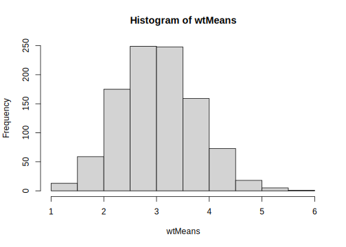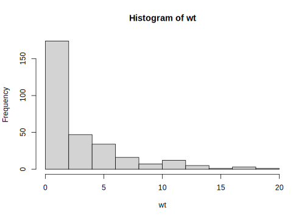

According to the Central Limit Theorem the means
follow a normal distribution. We can show this.


```r
qqnorm(wtMeans)
qqline(wtMeans, col = "red")
```

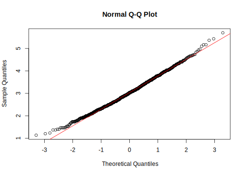

For another great visualization of the central limit
theorem, check out this interactive tutorial by
[Seeing Theory](https://seeing-theory.brown.edu/probability-distributions/index.html#section3).

## The T-Distribution

The CLT is only valid for large  _sample sizes_.
For smaller sample sizes, the distribution of
means has fatter tails than a normal distribution

This is why for most statistical tests,
we use the t-distribution instead of the
normal distribution.

For 3 degrees of freedom (DF):


```r
tdist <- function(x) dt(x, df = 3)
curve(dnorm, -3, 3)
curve(tdist, -3, 3, add = TRUE, col = "red")
```

<div class="figure">
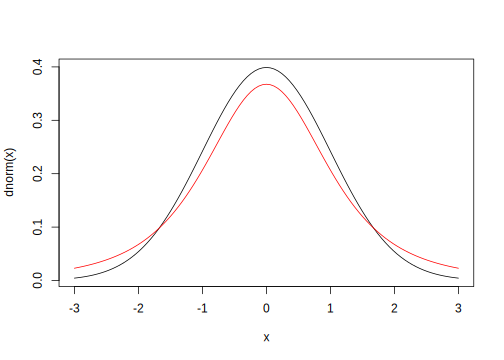
<p class="caption">(\#fig:tdist)t-distribution in red, normal distribution in black.</p>
</div>

For 30 DF:


```r
tdist <- function(x) dt(x, df = 30)
curve(dnorm, -3, 3)
curve(tdist, -3, 3, add = TRUE, col = "red")
```

<div class="figure">
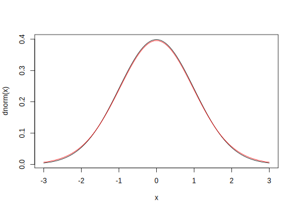
<p class="caption">(\#fig:tdist2)t-distribution in red, normal distribution in black.</p>
</div>

### Confidence Intervals (CIs)

We can use the t-distribution to
calculate (95%-) confidence intervals.

The 95% CI of a sample mean contains the
true mean (the mean of the population)
in 95% of cases (if you where to repeat the experiment
infinitely often).


```r
hist(wtMeans)
abline(v = mean(wt), col = "red")
```

<div class="figure">
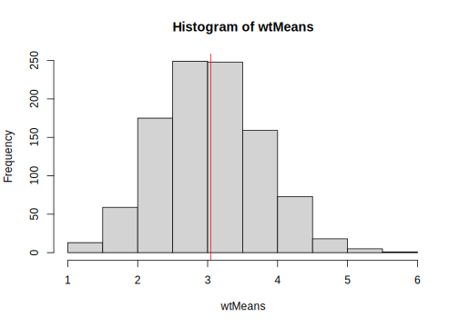
<p class="caption">(\#fig:ci-vis)True mean in red.</p>
</div>


```r
draw <- sample(wt, 7)
CI <- t.test(draw)$conf.int
hist(draw)
abline(v = CI[1], col = "red")
abline(v = CI[2], col = "red")
```

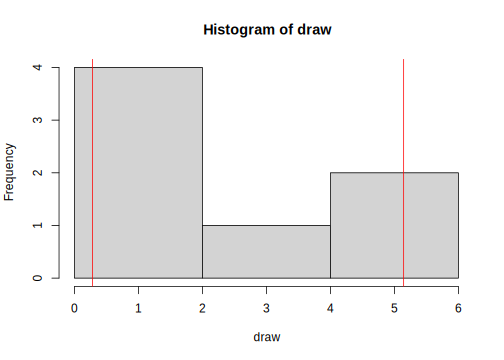

## Significance Tests

Significance tests answer the question:

> _"Under the assumption of no difference
  between two (or more) groups (i.e. they
  are samples of the same population),
  what is the probability to find a difference
  as large as or more extreme than the
  difference observed."_

### Students T-Test

For normally distributed data,
we would use students t-test.


```r
t.test(wt, ko)
```

```
## 
## 	Welch Two Sample t-test
## 
## data:  wt and ko
## t = -26.929, df = 476.21, p-value < 2.2e-16
## alternative hypothesis: true difference in means is not equal to 0
## 95 percent confidence interval:
##  -13.19393 -11.39940
## sample estimates:
## mean of x mean of y 
##  3.043333 15.340000
```


```r
wtDraw <- sample(wt, 3, replace = TRUE)
koDraw <- sample(ko, 3, replace = TRUE)
t.test(wtDraw, koDraw)
```

```
## 
## 	Welch Two Sample t-test
## 
## data:  wtDraw and koDraw
## t = -2.2283, df = 3.0218, p-value = 0.1115
## alternative hypothesis: true difference in means is not equal to 0
## 95 percent confidence interval:
##  -19.378879   3.378879
## sample estimates:
## mean of x mean of y 
##  5.666667 13.666667
```

But our data is not normally distributed!


```r
data %>% 
  pivot_longer(c(1,2)) %>% 
  ggplot(aes(name, value, fill = name)) +
  geom_jitter()
```

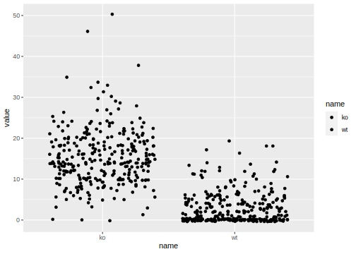

### Wilcoxon Rank Sum Test

With non-normal data, we need a so called
**non-parametric** test. Those tests do not
make the assumption of normality.

The Wilcoxon Rank Sum test (also called Mann-Whitney U test)
takes the values and converts them into "ranks"
before comparing them.

The rank of a value in our dataset answers the question:

> "When sorting the values from lowest to highest,
  what is the index of that value?"

Example:


```r
x <- c(1,2,1.12312, 4000000, 42)
rank(x)
```

```
## [1] 1 3 2 5 4
```

We run this test in R as follows:


```r
wilcox.test(wt, ko)
```

```
## 
## 	Wilcoxon rank sum test with continuity correction
## 
## data:  wt and ko
## W = 4707.5, p-value < 2.2e-16
## alternative hypothesis: true location shift is not equal to 0
```

## Type I and Type II Errors

- Type I:  False Positives (rejection of a true null hypothesis)
- Type II: False Negatives (non-rejection of false null hypothesis)

### Type I: False Positives

A type I error means we find a difference between
samples even though there is none (they are from
the same population)

We often define a p-value $\leq$ 0.05 (= 5\ %) as
a "statistically significant" result. Keep in mind,
that this cutoff is arbitrary and has no physical
meaning. This cutoff also means that by definition
we are accepting a minimum of 5% false positives!
This cutoff, the significance level is also called
$\alpha$.

$$\alpha=\text{Type I error rate}$$


```r
curve(dnorm, -3, 3)
```


```r
n <- 5
draw1 <- rnorm(n)
draw2 <- rnorm(n)
```


```r
t.test(draw1, draw2)
```

```
## 
## 	Welch Two Sample t-test
## 
## data:  draw1 and draw2
## t = 0.85987, df = 7.9773, p-value = 0.415
## alternative hypothesis: true difference in means is not equal to 0
## 95 percent confidence interval:
##  -0.9470132  2.0723043
## sample estimates:
##   mean of x   mean of y 
## 0.571204782 0.008559254
```


```r
wilcox.test(draw1, draw2)
```

```
## 
## 	Wilcoxon rank sum exact test
## 
## data:  draw1 and draw2
## W = 16, p-value = 0.5476
## alternative hypothesis: true location shift is not equal to 0
```
 
Test this code with different values of `n`.

### Type II: False Negatives

If there exists a true difference between samples
(i.e. they come from a different population), but
we do not detect that difference ("not statistically significant"),
we commit a type II error.

A type II error is thus a false negative result.
the type II error rate is called  $\beta$
(analogous to $\alpha$).

$$\beta=\text{Type II error rate}$$


```r
n <- 5
draw1 <- rnorm(n, mean = 0)
draw2 <- rnorm(n, mean = 1)
```


```r
t.test(draw1, draw2)
```

```
## 
## 	Welch Two Sample t-test
## 
## data:  draw1 and draw2
## t = -0.93826, df = 7.8395, p-value = 0.3761
## alternative hypothesis: true difference in means is not equal to 0
## 95 percent confidence interval:
##  -2.464869  1.042769
## sample estimates:
## mean of x mean of y 
## 0.5616486 1.2726987
```


```r
wilcox.test(draw1, draw2)
```

```
## 
## 	Wilcoxon rank sum exact test
## 
## data:  draw1 and draw2
## W = 9, p-value = 0.5476
## alternative hypothesis: true location shift is not equal to 0
```

Repeat with different values of `n`.

### Statistical Power

The power of a statistical test is the probability
to classify a real difference as statistically
significant (with the chosen $\alpha$).
So it represents true positives.

$$Power = 1-\beta$$

In R, we have the function `power.t.test`, which
can tell us the power (or any of the arguments left blank / set to NULL)


```r
power.t.test(n = NULL,
             delta = 5,
             sd = 1,
             sig.level = 0.05,
             power = 0.9)
```

```
## 
##      Two-sample t test power calculation 
## 
##               n = 2.328877
##           delta = 5
##              sd = 1
##       sig.level = 0.05
##           power = 0.9
##     alternative = two.sided
## 
## NOTE: n is number in *each* group
```

## Problems

### The Jelly Bean Problem (Multiple Testing)


Controlling the False Discovery Rate (FDA):

#### Bonferroni correction


```r
pValues <- c(0.5, 0.05, 0.3, 0.001, 0.003)
p.adjust(pValues, method = "bonferroni")
```

```
## [1] 1.000 0.250 1.000 0.005 0.015
```

#### Benjamini-Hochberg procedure

- Sort all p-values in ascending order
- Choose a FDR $q$ and call the number of tests done $m$
- Find the largest p-value with:
  $p \leq iq/m$ with its index $i$.
- This is your new threshold for significance


```r
p.adjust(pValues, method = "BH")
```

```
## [1] 0.50000000 0.08333333 0.37500000 0.00500000 0.00750000
```

### The Base Rate Fallacy

Example: mammogram

- Sensitivity = Power = true positive rate
- Specificity = true negative rate = $1-\alpha$


```r
total <- 1000
positives <- 10
negatives <- total - positives
sensitivity <- 0.9
specificity <- 1 - 0.08
true_positives  <- sensitivity * positives
false_positives <- (1 - specificity) * negatives
p_positive <- true_positives / (true_positives + false_positives)
```


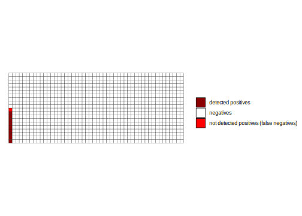

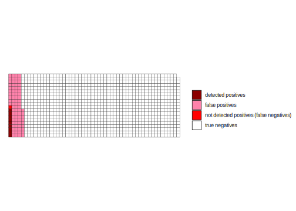


```r
p_positive
```

```
## [1] 0.1020408
```

Bayes Formula:

$$P(A|B)=\frac{P(B|A)*P(A)}{P(B)}$$

With $P(X)$ as the probability of $X$ and $P(X|Y)$ being the
probability of $X$ given $Y$ (_conditional probability_).

In terms of our example:

$$P( Cancer | positive Test)=\frac{P(positive Test|Cancer)*P(Cancer)}{P(positive Test)}$$

The probability of having the disease given a positive test result ($P(A|B)$),
is equal to the probability of testing positive while having the disease
(the sensitivity!) times the probability of having the disease just based on
the prevalence of the disease (this is also called the prior probability, $P(A)$)
divided by the probability of testing positive, no matter the condition.
The latter part, the denominator, can be broken down further
to be expressed in terms of our definitions from the beginning
of this section:

$$P( Cancer | positive Test)=\frac{P(positive Test|Cancer)*P(Cancer)}{P(positive Test | Cancer) *  P(Cancer) + P(positive Test | no Cancer) *  P(no Cancer)}$$

So in other words:

$$P( Cancer | positive~test)=\frac{Sensitivity*Prevalence}{Sensitivity *  Prevalence + (1-Specificity) *  (1-Prevalence)}$$

### Resources

- Statistics Done Wrong: https://www.statisticsdonewrong.com/
- Intuitive Biostatistics, also in the Uni-Bib: https://katalog.ub.uni-heidelberg.de/cgi-bin/titel.cgi?katkey=68260114&sess=050a1316767b181982c9bce94283e9ae&query=Intuitive%20Biostatistics
- https://www.graphpad.com/guides/prism/8/statistics/index.htm

## Exercises

### Show the following statements with simulations in R

#### Increasing the sample size n reduces the standard error of the mean with the square root of n.

- Draw 10 cells from the wt (or ko) vector
- calculate the mean
- write a function that does that
- run it 1000 times and save the result in a vector
- calculate the SD of the means
- now, draw 40 instead of 10 cells and repeat. How does the SD change?
- Write a function of n that does above steps
- Feed the numbers from 1 to 100 to the function and
  plot the resulting SDs


```r
getMeanOfSample <- function(x, n) sample(x, n, replace = TRUE) %>% mean()
getSdOfManyMeans <- function(n, x) {
  map_dbl(1:100, ~ getMeanOfSample(x, n) ) %>% sd()
}

sdByN <- tibble(N = 1:100) %>% 
  mutate(sd = map_dbl(N, getSdOfManyMeans, x = wt))

sdByN %>% 
  ggplot(aes(N, sd)) +
  geom_point()
```

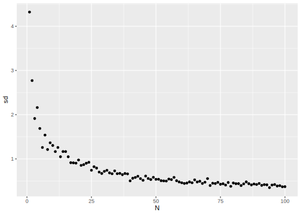

#### A 95% confidence interval of a sample contains the true mean (of the population) with a probability of 95%

- draw 30 cells from the wt (or ko) vector
- Calculate the limits of the CI
- write a function that does that
- use `map` or `replicate` to get 1000 sets of limits
- Write a function that tests, if a set
  of limits contains the true mean
- Map this function over the list of limits
- How often to you obtain `TRUE`?


```r
calculateCIforSample <- function(x, n) {
  sample(x, n, replace = TRUE) %>%
    t.test() %>% 
    pluck("conf.int")
}

testLimitContainsMean <- function(limit, M) {
  limit[1] <= M && limit[2] >= M
}

manyCIs <- map(1:100, ~ calculateCIforSample(wt, 30))

map_lgl(manyCIs, testLimitContainsMean, M  = mean(wt)) %>% 
  mean()
```

```
## [1] 0.91
```

Optionally


```r
manyCIs %>% 
  enframe() %>% 
  unnest_wider(value) %>% 
  head()
```

```
## # A tibble: 6 x 3
##    name  ...1  ...2
##   <int> <dbl> <dbl>
## 1     1  1.10  2.77
## 2     2  1.47  4.27
## 3     3  1.59  4.88
## 4     4  1.24  3.16
## 5     5  2.00  5.20
## 6     6  2.74  6.32
```


### Show the following concepts with simulations in R

#### Sensitivity: With a true difference existing, how large is the probability to detect it (i.e. get a p-value <= 0.05) with a wilcoxon rank sum test?

- Draw a sample of 30 from the wt and the ko vector and test
  for a statistically significant difference
- Do this 1000 times. How many are statistically significant?
- What changes when you draw 10 instead of 30? Or 5?


```r
runWilcoxOnSample <- function(n, x1, x2) {
  draw1 <- sample(x1, n, replace = TRUE)
  draw2 <- sample(x2, n, replace = TRUE)
  wilcox.test(draw1, draw2, exact = FALSE)$p.value
}

pValues <- map_dbl(1:1000, ~ runWilcoxOnSample(9, wt, ko))
mean(pValues <= 0.05)
```

```
## [1] 0.993
```

```r
hist(pValues)
```

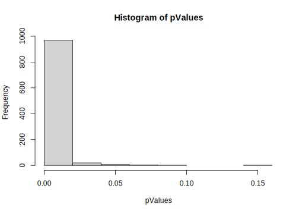


```r
?wilcox.test
```


#### Specificity: With **no** difference existing, what is the probability to detect one nonetheless?

- Imagine all cells are wt-cells
- Draw two samples of n = 30 from the wt-cells (i.e. the same population)
  and run a wilcoxon rank sum test
- Repeat 1000 times
- How are the p-values distributed?
- How often is the result statistically significant?


```r
pValues <- map_dbl(1:1000, ~ runWilcoxOnSample(10, wt, wt))
mean(pValues <= 0.05)
```

```
## [1] 0.049
```

```r
hist(pValues)
```

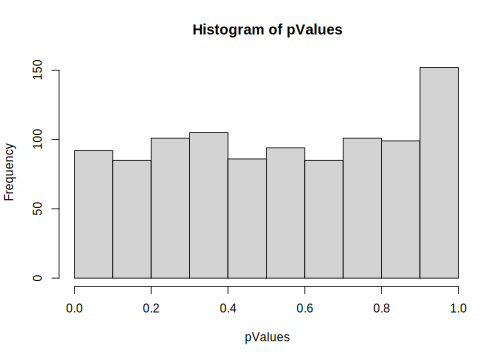


#### Resource for p-value Histograms

http://varianceexplained.org/statistics/interpreting-pvalue-histogram/


#### Further notes


```r
source("usefullFunctions.R")
```


Note: I showed you a lot of map functions, but
often, you don't need a map function because
a lot of the basic operations in R are
vectorised by default (so they operate on
elements of vectors).

With two vectors `x` and `y`


```r
x <- 1:5
y <- 1:5
```

We can just write


```r
x + y
```

```
## [1]  2  4  6  8 10
```

Instead of


```r
map2_dbl(x,y, `+`)
```

```
## [1]  2  4  6  8 10
```


