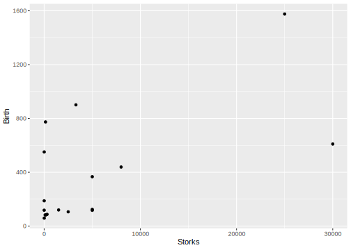
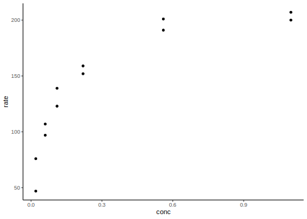
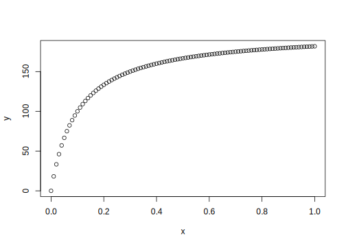
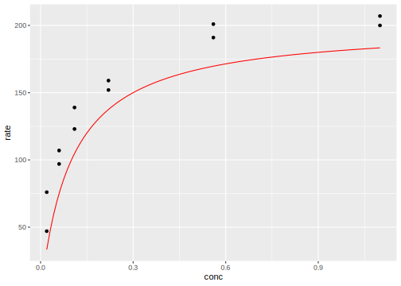
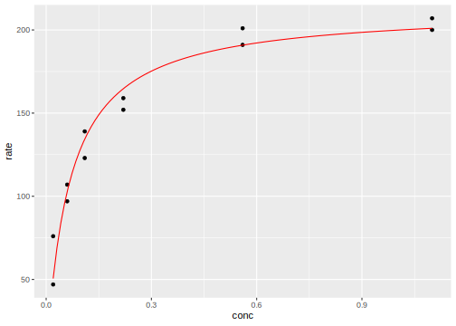
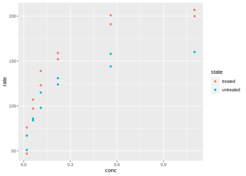
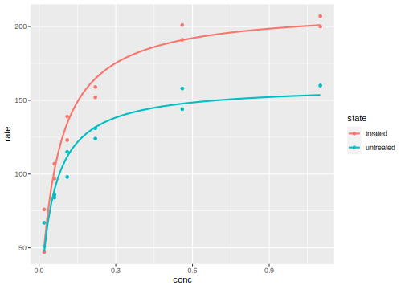

# Correlation and Regression {#day5}

## Side note: What is the main goal of this course?

I can not teach you every single function,
every data structure, every statistical analysis.

Rather, I want to give you a high level overview
of what is possible. And I want to teach you
how you can view your data problems in a way
that enables you to solve them.

We want to go from seeing the numbers


To seeing the structure behind it


## Correlation and Regression

The data for today are available from their
[original source](https://figshare.com/articles/Storks_and_human_babies_data/839299/1)
or [my github repository](https://github.com/jannikbuhr/dataIntro19Master/tree/master/data).

It's about storks! And because according to folk wisdom storks bring
the babies, we get the number of stork pairs per country and
the birthrate in $10^3$ babies per year.
Additionally, we get the number of people per country and
the area in $km^2$.


```r
library(tidyverse)
```

```
## ── Attaching packages ────────
```

```
## ✓ ggplot2 3.3.2     ✓ purrr   0.3.4
## ✓ tibble  3.0.3     ✓ dplyr   1.0.1
## ✓ tidyr   1.1.1     ✓ stringr 1.4.0
## ✓ readr   1.3.1     ✓ forcats 0.5.0
```

```
## ── Conflicts ─────────────────
## x dplyr::filter() masks stats::filter()
## x dplyr::lag()    masks stats::lag()
```

```r
storks <- read_csv("data/05_storks.csv")
```

```
## Parsed with column specification:
## cols(
##   Country = col_character(),
##   Area = col_double(),
##   Storks = col_double(),
##   Humans = col_double(),
##   Birth = col_double()
## )
```

```r
head(storks)
```

```
## # A tibble: 6 x 5
##   Country    Area Storks Humans Birth
##   <chr>     <dbl>  <dbl>  <dbl> <dbl>
## 1 Albania   28750    100    3.2    83
## 2 Austria   83860    300    7.6    87
## 3 Belgium   30520      1    9.9   118
## 4 Bulgaria 111000   5000    9     117
## 5 Denmark   43100      9    5.1    59
## 6 France   544000    140   56     774
```

This data shows a clear relationship between the number
of stork pairs and the birthrate in a country [@matthews2000].


```r
# show storks vs birth rate with ggplot, points
ggplot(storks, aes(Storks, Birth)) +
  geom_point()
```



The data looks better on a logarithmic scale,
this diminishes the effect of outliers in our plot.


```r
# ggplot with dual log scale and annotation_logticks, theme classic
ggplot(storks, aes(Storks, Birth)) +
  geom_point() +
  scale_x_log10() +
  scale_y_log10() +
  annotation_logticks() +
  theme_classic()
```


Log transformations are in fact quite important
for a range of applications. Especially in
biological data, you will encounter them
quite a bit. The reason is as follows:
While the central limit theorem states
that the **sum** of independent random variables
tends towards a normal distribution,
biological processes often contain signal
cascades and other **multiplicative** effects.
A logarithm conveniently turns a **product**
into a **sum**, so while your original
data may not look very much like a normal
distribution, it might very well be
_log-normal_.

### Correlation

We get a measure of linear relation between to random variables
with the (Pearson's) correlation coefficient.

$$cor(X,Y)=\frac{cov(X,Y)}{\sigma_X \sigma_Y}=\frac{E\left[(X-\mu_X)(Y-\mu_Y)\right]}{\sigma_X \sigma_Y}$$

$cor$ is equal to the quotient of the co variance $cov$ and
the product of the standard deviations $\sigma$. The
co variance in turn is the expected value (i.e. the mean)
of the element-wise product of the difference of
vector X to its mean and the difference of vector Y to its mean.


```r
cor(storks$Storks, storks$Birth)
```

```
## [1] 0.6202653
```


```r
cor(log(storks$Storks), log(storks$Birth))
```

```
## [1] 0.3853895
```

The correlation coefficient is also called
_Pearson's R_, and its square consequently
is _R squared_. This value is the
coefficient of determination, the fraction
of explained variance of one variable by
the other.


```r
cor(storks$Storks, storks$Birth)^2
```

```
## [1] 0.3847291
```

Both `cor` and `cor.test` can used
the Spearman method to return correlation
of ranks instead of values.


```r
cor(storks$Storks, storks$Birth, method = "spearman")
```

```
## [1] 0.4176917
```

```r
cor(log(storks$Storks), log(storks$Birth), method = "spearman")
```

```
## [1] 0.4176917
```

<div class="figure">

<p class="caption">(\#fig:unnamed-chunk-8)Source: XKCD, https://www.xkcd.com/552/</p>
</div>

### Regression

A related concept is linear regression.


```r
model <- lm(Birth ~ Storks, data = storks)
summary(model)
```

```
## 
## Call:
## lm(formula = Birth ~ Storks, data = storks)
## 
## Residuals:
##    Min     1Q Median     3Q    Max 
## -478.8 -166.3 -144.9   -2.0  631.1 
## 
## Coefficients:
##              Estimate Std. Error t value Pr(>|t|)   
## (Intercept) 2.250e+02  9.356e+01   2.405   0.0295 * 
## Storks      2.879e-02  9.402e-03   3.063   0.0079 **
## ---
## Signif. codes:  0 '***' 0.001 '**' 0.01 '*' 0.05 '.' 0.1 ' ' 1
## 
## Residual standard error: 332.2 on 15 degrees of freedom
## Multiple R-squared:  0.3847,	Adjusted R-squared:  0.3437 
## F-statistic:  9.38 on 1 and 15 DF,  p-value: 0.007898
```

This _R squared_ value is in fact the coefficient of
determination that you saw earlier for correlation.
When your linear model is free to choose an intercept,
this R squared also has the same value as for correlation.

Using `geom_smooth`, we
can fit any model to our data right
within ggplot, even after applying
the log-transformation.


```r
storks %>% 
  ggplot(aes(Storks, Birth)) +
  geom_point() +
  scale_x_log10() +
  scale_y_log10() +
  geom_smooth(method = "lm",
              se     = FALSE,
              color  = "red")
```

```
## `geom_smooth()` using formula 'y ~ x'
```


But what happens when our data does not follow
a linear model?

## Non-Linear Regression

### Michaelis-Menten Kinetics

As an example we will use the common Michaelis-Menten kinetics.
There is a dataset for enzyme reaction rates included in R.


```r
puromycin <- as_tibble(Puromycin)

treatedPuro <- puromycin %>% 
  filter(state == "treated")

head(treatedPuro)
```

```
## # A tibble: 6 x 3
##    conc  rate state  
##   <dbl> <dbl> <fct>  
## 1  0.02    76 treated
## 2  0.02    47 treated
## 3  0.06    97 treated
## 4  0.06   107 treated
## 5  0.11   123 treated
## 6  0.11   139 treated
```


```r
plot(treatedPuro$conc, treatedPuro$rate, main = "In case you miss base-R")

treatedPuro %>% 
  ggplot(aes(conc, rate)) +
  geom_point() +
  theme_classic()
```



This data follows a Michaelis-Menten kinetic,
so we define a function that translates
a concentration into a rate given
a maximal velocity Vm and the Michaelis-Menten
constant K. Having the concentration
as the first argument helps for later usage
of the function.


```r
calcMicMen <- function(conc, Vm, K) {
  (Vm * conc) / (K + conc)
}
```

`calcMicMen` is actually vectorised by default,
because it just used basic mathematical operations:


```r
x <- seq(0, 1, by = 0.01)
y <- calcMicMen(x, Vm = 200, K = 0.1)
plot(x,y)
```



We can plot this function with some
initial values for Vm and K using
`stat_function` (it is a `stat`, not
a `geom`, because it needs to do
some calculation on the data before
plotting it). Note that we use a lambda
function to define a function
on the fly that is only dependent 
on one argument, passed as `.x` and
already has Vm and K set at some value
we chose.


```r
treatedPuro %>% 
  ggplot(aes(conc, rate)) +
  geom_point() +
  stat_function(fun   = ~ calcMicMen(conc = .x, Vm = 200, K = 0.1),
                color = "red")
```



Another way to write this is using the
`args` argument of `stat_fun`. This way, we
can supply just the name of the function and
additional arguments such as Vm and K go
into a list passed to `args`. The only argument
we do not supply (`conc`) is then
automatically taken from the x-axis and
the result uses as the y-value.


```r
# output not shown because it is the same as above
treatedPuro %>% 
  ggplot(aes(conc, rate)) +
  geom_point() +
  stat_function(fun   = calcMicMen,
                args  = list(Vm = 200, K = 0.1),
                color = "red")
```

But this function doesn't fit our data! It
just has some Vm and K that we manually
put in, so let's use R to move
it closer to our data. This process of taking
some initial function and moving
it closer to our data is called
_least squares regression_ and as opposed
to the simple case of linear models earlier,
here we are using a non-linear model and thus the
function `nls` for non-linear least squares.


```r
model <- nls(formula = rate ~ calcMicMen(conc, Vm, K),
             data    = treatedPuro,
             start   = list(Vm = 200, K = 0.1))
model
```

```
## Nonlinear regression model
##   model: rate ~ calcMicMen(conc, Vm, K)
##    data: treatedPuro
##        Vm         K 
## 212.68363   0.06412 
##  residual sum-of-squares: 1195
## 
## Number of iterations to convergence: 6 
## Achieved convergence tolerance: 6.093e-06
```

It also tells us the residual sum of squares,
which is a measure of distance between the
function and our data. For a brilliant
interactive visualization of this process,
check out this [link](http://setosa.io/ev/ordinary-least-squares-regression/)
[@OrdinaryLeastSquares]!


```r
summary(model)
```

```
## 
## Formula: rate ~ calcMicMen(conc, Vm, K)
## 
## Parameters:
##     Estimate Std. Error t value Pr(>|t|)    
## Vm 2.127e+02  6.947e+00  30.615 3.24e-11 ***
## K  6.412e-02  8.281e-03   7.743 1.57e-05 ***
## ---
## Signif. codes:  0 '***' 0.001 '**' 0.01 '*' 0.05 '.' 0.1 ' ' 1
## 
## Residual standard error: 10.93 on 10 degrees of freedom
## 
## Number of iterations to convergence: 6 
## Achieved convergence tolerance: 6.093e-06
```

We get the estimated coefficients (the fitted Vm and K)
from our model with the function `coef`.


```r
Vm_est <- coef(model)["Vm"]
K_est  <- coef(model)["K"]
coef(model)
```

```
##           Vm            K 
## 212.68362994   0.06412111
```

Now we can supply those as arguments to the
`calcMicMen` function used in `stat_function`


```r
treatedPuro %>% 
  ggplot(aes(conc, rate)) +
  geom_point() +
  stat_function(fun   = calcMicMen,
                args  = list(Vm = Vm_est, K = K_est),
                color = "red")
```



Side note: There is also _self starting models_,
but I do not cover them a lot because their use case
is more specific than being able to fit
any self defined function. Self starting
models are able to estimate sensible starting 
parameters from the data.


```r
nls(formula = rate ~ SSmicmen(conc, Vm, K),
    data = treatedPuro)
```

```
## Nonlinear regression model
##   model: rate ~ SSmicmen(conc, Vm, K)
##    data: treatedPuro
##        Vm         K 
## 212.68371   0.06412 
##  residual sum-of-squares: 1195
## 
## Number of iterations to convergence: 0 
## Achieved convergence tolerance: 1.929e-06
```

You can use any model created with a modeling
function such as `nls` or `lm` with
the `predict` function to predict new values
for new data:


```r
predict(model, newdata = list(conc  = c(0, 0.5, 1)))
```

```
## [1]   0.0000 188.5088 199.8679
```

### Many Models

The superpower of tibbles!

Our data set actually contained
two experimental conditions,
one where the enzyme was treated and another
where it was not.


```r
puromycin %>% 
  ggplot(aes(conc, rate, color = state)) + 
  geom_point()
```



We want to fit models to both conditions
individually, without having to write the
same code twice. In order to achieve this,
we first _nest_ the data. We retain one
column with the _state_ and the data for
that state is in another column called _data_
and stored as a list of tibbles (one tibble
for each state). So we go from this:


```r
head(puromycin)
```

```
## # A tibble: 6 x 3
##    conc  rate state  
##   <dbl> <dbl> <fct>  
## 1  0.02    76 treated
## 2  0.02    47 treated
## 3  0.06    97 treated
## 4  0.06   107 treated
## 5  0.11   123 treated
## 6  0.11   139 treated
```

To this:


```r
nestedPuromycin <- puromycin %>% 
  group_nest(state)

nestedPuromycin %>% 
  head()
```

```
## # A tibble: 2 x 2
##   state                   data
##   <fct>     <list<tbl_df[,2]>>
## 1 treated             [12 × 2]
## 2 untreated           [11 × 2]
```

Just to check that we didn't lose anything,
here I pluck the data column, from this I
pluck the first element and then I take only
the first 5 rows of this element with `head`.


```r
nestedPuromycin %>% 
  pluck("data", 1) %>% 
  head(5)
```

```
## # A tibble: 5 x 2
##    conc  rate
##   <dbl> <dbl>
## 1  0.02    76
## 2  0.02    47
## 3  0.06    97
## 4  0.06   107
## 5  0.11   123
```

Now we go on fitting a model for `every element`
of the data column, so for every sub-dataset (one for each state).
I also apply the `coef` function to all resulting
models and go straight ahead with unnesting
those coefficients into their own columns.


```r
nestedPuromycin %>% 
  mutate(
    model = map(data, ~ nls(formula = rate ~ calcMicMen(conc, Vm, K),
                            data = .x,
                            start = list(Vm = 200, K = 0.1))),
    coefficients = map(model, coef)
  ) %>% 
  unnest_wider(coefficients) %>% 
  head()
```

```
## # A tibble: 2 x 5
##   state                   data model     Vm      K
##   <fct>     <list<tbl_df[,2]>> <list> <dbl>  <dbl>
## 1 treated             [12 × 2] <nls>   213. 0.0641
## 2 untreated           [11 × 2] <nls>   160. 0.0477
```

ggplot is also able to fit
individual models and it can use any
fitting-function in `geom_smooth`,
not just linear models. So nothing
is stopping us from writing:


```r
puromycin %>% 
  ggplot(aes(conc, rate, color = state)) +
  geom_point() +
  geom_smooth(
    method       = "nls",
    formula      = y ~ calcMicMen(conc  = x, Vm, K),
    method.args  = list(start = list(Vm = 200, K = 0.1)),
    se           = FALSE
  )
```



Note that we need to supply the formula for the
method nls in a general form (with y ~ x) and
the additionally arguments that nls needs, namely
the starting parameters, are supplied as a list
with `method.args`. We also set the standard
error `se` to `FALSE` because `"nls"` doesn't
report it, so if we where to try and display it,
we would get an error message.

## Exercises

### With the Datasaurus Dozen Data Sets


```r
datasauRus::datasaurus_dozen
```

- Visualize all data sets in one ggplot,
  - Hint: use`facet_wrap`
- Add linear regression lines
  - Hint: use `geom_smooth`
- Do the fit manually on the dataset and extract the coefficients
  - Hints: See above, nest the data first, create the model column, etc.
  
#### Solutions


```r
dinos <- datasauRus::datasaurus_dozen
head(dinos)
```

```
## # A tibble: 6 x 3
##   dataset     x     y
##   <chr>   <dbl> <dbl>
## 1 dino     55.4  97.2
## 2 dino     51.5  96.0
## 3 dino     46.2  94.5
## 4 dino     42.8  91.4
## 5 dino     40.8  88.3
## 6 dino     38.7  84.9
```


```r
dinos %>% 
  filter(dataset == "dino") %>% 
  ggplot(aes(x, y)) +
  geom_point() +
  facet_wrap(~ dataset) +
  geom_smooth(method = "lm") +
  coord_equal()
```

```
## `geom_smooth()` using formula 'y ~ x'
```


```r
nestedDinos <- dinos %>% 
  group_nest(dataset)

nestedDinos %>% 
  mutate(model  = map(data, ~ lm(y ~ x, data = .x )),
         coef   = map(model, coef),
         resids = map(model, residuals))
```

```
## # A tibble: 13 x 5
##    dataset                  data model  coef      resids     
##    <chr>      <list<tbl_df[,2]>> <list> <list>    <list>     
##  1 away                [142 × 2] <lm>   <dbl [2]> <dbl [142]>
##  2 bullseye            [142 × 2] <lm>   <dbl [2]> <dbl [142]>
##  3 circle              [142 × 2] <lm>   <dbl [2]> <dbl [142]>
##  4 dino                [142 × 2] <lm>   <dbl [2]> <dbl [142]>
##  5 dots                [142 × 2] <lm>   <dbl [2]> <dbl [142]>
##  6 h_lines             [142 × 2] <lm>   <dbl [2]> <dbl [142]>
##  7 high_lines          [142 × 2] <lm>   <dbl [2]> <dbl [142]>
##  8 slant_down          [142 × 2] <lm>   <dbl [2]> <dbl [142]>
##  9 slant_up            [142 × 2] <lm>   <dbl [2]> <dbl [142]>
## 10 star                [142 × 2] <lm>   <dbl [2]> <dbl [142]>
## 11 v_lines             [142 × 2] <lm>   <dbl [2]> <dbl [142]>
## 12 wide_lines          [142 × 2] <lm>   <dbl [2]> <dbl [142]>
## 13 x_shape             [142 × 2] <lm>   <dbl [2]> <dbl [142]>
```


```r
dinos %>% 
  filter(dataset == "dino") %>% 
  lm(data = ., y ~ x) %>% 
  broom::augment() %>% 
  ggplot(aes(x, .resid)) +
  geom_point()
```


### Example Data Analysis

As an exemplary data analysis,
I quickly went through some actual lab data
from y'all. Because the data is
not yet published, this section only
provides the code and can not be
run by itself.

However, I leave you with a couple
of pointers to excellent learning
resources to understand the vital
data cleaning steps for this "untidy"
dataset. This code can of course
be used in an R script but I split
it up into individual chunks
to provide more explanation.

First, we load the tidyverse and
read in the raw data from and excel file


```r
# not run
library(tidyverse)
rawData <- readxl::read_excel("data/Data Rkurs .xlsx")
```

Not on to data tidying. The `tidyr` package
from the tidyverse comes in handy here.
The first column, which was unnamed and thus
called `..1` by R. Actually contains
more than one feature. So we extract the
features _compound_ and _condition_ into
their own columns with the `extract`
function. The _regular expression_ (regex)
provides two groups with which to extract
the data from the text in the original
column.
Check out [the help page](https://tidyr.tidyverse.org/reference/extract.html)
for more examples.
A great resource for most data analysis
tasks are the RStudio cheat sheets.
They provide most of what you need
in a concise format:
[https://rstudio.com/resources/cheatsheets/](https://rstudio.com/resources/cheatsheets/)
One of those also provides a guide
to the regular expressions we use in both cleaning
steps: [download cheatsheet](https://github.com/rstudio/cheatsheets/raw/master/strings.pdf). Additionally,
because finding the correct regular expression
can be hard, there is also an R package
out there, which provides an interactive
experience of building your regex called
`regexplain`. You can find it on github:
[regexplain link](https://github.com/gadenbuie/regexplain)
And frankly, it is magic!


```r
tidyData <- rawData %>% 
  extract(col = `...1`,
          into = c("compound", "condition"),
          regex = "(Compound \\d\\d?) (.+)") %>% 
  pivot_longer(starts_with("E"),
               names_to = c("experiment", "replicate"),
               names_pattern = "(E\\d)(.?)") %>% 
  mutate(compound = fct_reorder(compound, parse_number(compound)))
```

The data cleaning step was in fact the most
complicated thing about this analysis.
Once your data is in tidy format,
you can use the tools we discovered in
earlier weeks with ease:


```r
summaryData <- tidyData %>% 
  group_by(compound, condition) %>% 
  summarise(SEM = sd(value) / sqrt(n()),
            value = mean(value))

signif <- summaryData %>% 
  filter(compound  == "Compound 1") %>% 
  filter(condition == first(condition)) %>% 
  mutate(value = 100,
         label = "*")

tidyData %>% 
  ggplot(aes(compound, value,
             color = condition,
             fill = condition)) +
  geom_col(data = summaryData, position = position_dodge(width = 0.9),
           color = "black") +
  geom_errorbar(data = summaryData,
                aes(ymin = value - SEM,
                    ymax = value + SEM),
                position = position_dodge(width = 0.9),
                color = "black",
                width = 0.5) +
  geom_point(position = position_dodge(width = 0.9),
             shape = 21,
             color = "black") +
  geom_text(data = signif, aes(label = label),
            color = "black", size = 13,
            position = "identity") +
  theme(axis.text.x = element_text(angle = 45, hjust = 1))
```

You might also want to run a statistical analysis,
such as ANOVA, but this is just an example. Do
not take this as advice for which type of analysis
to run, this depends on your data and
hypothesis you want to test!


```r
anovaResult <- aov(value ~ compound * condition, data = tidyData)
TukeyHSD(anovaResult)$condition %>% head()
```

