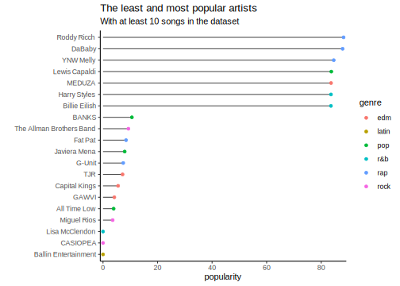

# Examples and Feedback {#day6}

## Random Sidenotes

This is a loose collection of data and concepts we explored.


```r
library(tidyverse)
```

```
## ── Attaching packages ────────
```

```
## ✓ ggplot2 3.3.2     ✓ purrr   0.3.4
## ✓ tibble  3.0.3     ✓ dplyr   1.0.1
## ✓ tidyr   1.1.1     ✓ stringr 1.4.0
## ✓ readr   1.3.1     ✓ forcats 0.5.0
```

```
## ── Conflicts ─────────────────
## x dplyr::filter() masks stats::filter()
## x dplyr::lag()    masks stats::lag()
```


```r
plt <- mpg %>%
  ggplot(aes(displ, cty)) +
  geom_point()

ggsave(filename = "myPlot.png", plot = plt)
```

- `ggsave` uses width and height of the
  current graphics device by default and messages
  them in the console
- Many files, many folders? Use `map`!


```r
paths <- dir("data", full.names = TRUE, pattern = ".csv")
paths <- set_names(paths, basename(paths))

allDatasets <- map(paths, read_csv)


createDataset <- function(i) {
  tibble(
    x = rnorm(100),
    y = rnorm(100)
  )
}

aBunchOfDatasets <- map(1:10, createDataset)
names(aBunchOfDatasets) <- paste0("myData/dataset ", 1:10, ".csv")
walk2(aBunchOfDatasets, names(aBunchOfDatasets), ~ write_csv(.x, path = .y) )
```


```r
paths <- dir("myData", pattern = ".csv", full.names = TRUE) %>% 
  set_names(basename(.))

allDatasets <- map_dfr(paths, read_csv, .id = "dataset")

allDatasets %>% 
  ggplot(aes(x, y)) +
  geom_point() +
  facet_wrap(~ dataset)
```

## Lot's of Examples

### Tidytuesday: Spotify


```r
rawData <- readr::read_csv('https://raw.githubusercontent.com/rfordatascience/tidytuesday/master/data/2020/2020-01-21/spotify_songs.csv')
```

```
## Parsed with column specification:
## cols(
##   .default = col_double(),
##   track_id = col_character(),
##   track_name = col_character(),
##   track_artist = col_character(),
##   track_album_id = col_character(),
##   track_album_name = col_character(),
##   track_album_release_date = col_character(),
##   playlist_name = col_character(),
##   playlist_id = col_character(),
##   playlist_genre = col_character(),
##   playlist_subgenre = col_character()
## )
```

```
## See spec(...) for full column specifications.
```


```r
spotifySongs <- rawData %>% 
    mutate(track_album_release_date = lubridate::ymd(track_album_release_date))
```

```
## Warning: Problem with `mutate()` input `track_album_release_date`.
## x  1886 failed to parse.
## ℹ Input `track_album_release_date` is `lubridate::ymd(track_album_release_date)`.
```

```
## Warning: 1886 failed to parse.
```

Popularity with One-Hit-Wonders removed.
You need to have at least 10 songs to be in my list.


```r
spotifySongs %>% 
  group_by(track_artist) %>% 
  filter(n() > 10) %>% 
  summarise(popularity = mean(track_popularity)) %>% 
  arrange(desc(popularity)) %>% 
  head()
```

```
## `summarise()` ungrouping output (override with `.groups` argument)
```

```
## # A tibble: 6 x 2
##   track_artist  popularity
##   <chr>              <dbl>
## 1 Roddy Ricch         88.2
## 2 DaBaby              87.9
## 3 YNW Melly           84.6
## 4 Lewis Capaldi       83.7
## 5 MEDUZA              83.6
## 6 Harry Styles        83.6
```


```r
getMainGenre <- function(x) {
  names( table(x)[which.max(table(x))] )
}
```


```r
byArtist <- spotifySongs %>% 
  group_by(track_artist) %>% 
  filter(n() > 10) %>% 
  summarise(popularity = mean(track_popularity),
            genre = getMainGenre(playlist_genre)) %>% 
  top_n(n = 20, wt = abs(mean(popularity) - popularity)) %>% 
  mutate(track_artist = fct_reorder(track_artist, popularity))
```

```
## `summarise()` ungrouping output (override with `.groups` argument)
```


```r
byArtist %>% 
  ggplot(aes(x = track_artist, y = popularity,
             color = genre)) +
  geom_linerange(aes(ymax = popularity), ymin = 0, color = "grey30") +
  geom_point() +
  coord_flip() +
  scale_y_continuous(expand = c(0,1)) +
  theme_classic() +
  labs(x = "",
       title = "The least and most popular artists",
       subtitle = "With at least 10 songs in the dataset")
```




```r
spotifySongs %>% 
  filter(playlist_genre == "rock") %>% 
  ggplot(aes(track_album_release_date, valence)) +
  geom_point()
```

```
## Warning: Removed 804 rows containing missing values (geom_point).
```


### Shiny App

Create a file called `app.R`, copy and paste,
hit run app in the top right corner.


```r
library(shiny)
library(tidyverse)

rawData <- readr::read_csv('https://raw.githubusercontent.com/rfordatascience/tidytuesday/master/data/2020/2020-01-21/spotify_songs.csv')
spotifySongs <- rawData %>% 
    mutate(track_album_release_date = lubridate::ymd(track_album_release_date))

ui <- fluidPage(
    titlePanel("Old Faithful Geyser Data"),
    sidebarLayout(
        sidebarPanel(
            selectInput("genre",
                        "Select a Genre",
                        choices = unique(spotifySongs$playlist_genre)),
            selectInput("variable",
                        "Select a Genre",
                        choices = c("valence", "loudness",
                                    "speechiness",
                                    "liveness",
                                    "energy"))
        ),
        mainPanel(
           plotOutput("plot")
        )
    )
)

server <- function(input, output) {

    output$plot <- renderPlot({
        spotifySongs %>% 
            filter(playlist_genre == input$genre) %>% 
            ggplot(aes(track_album_release_date, !!sym(input$variable) )) +
            geom_point()
    })
}

# Run the application 
shinyApp(ui = ui, server = server)
```


